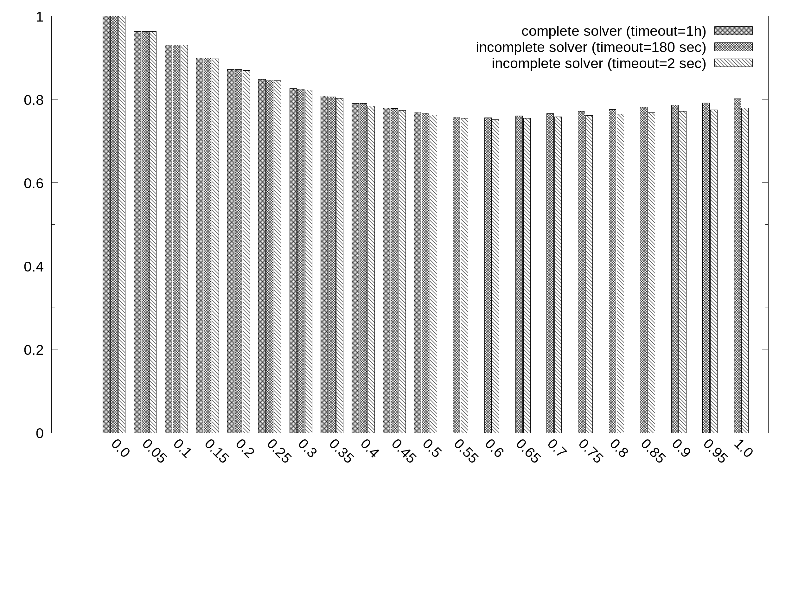
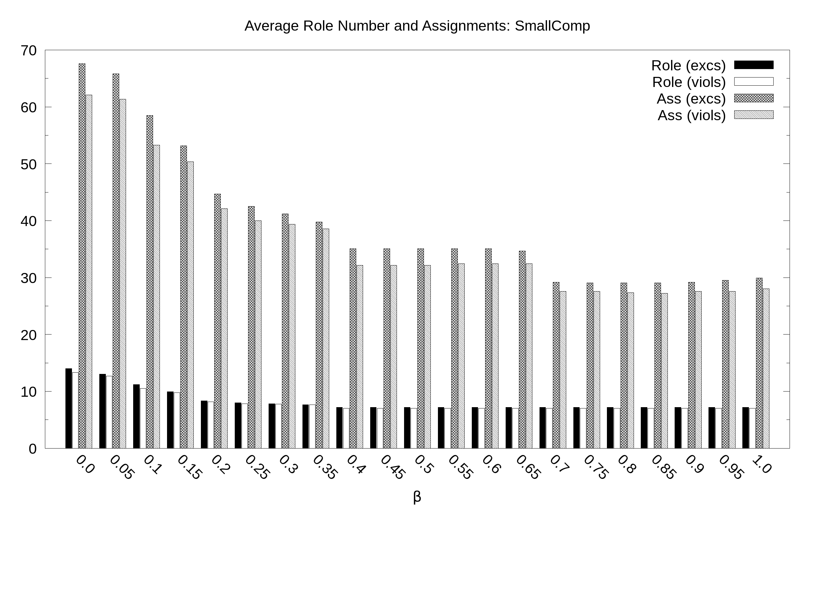
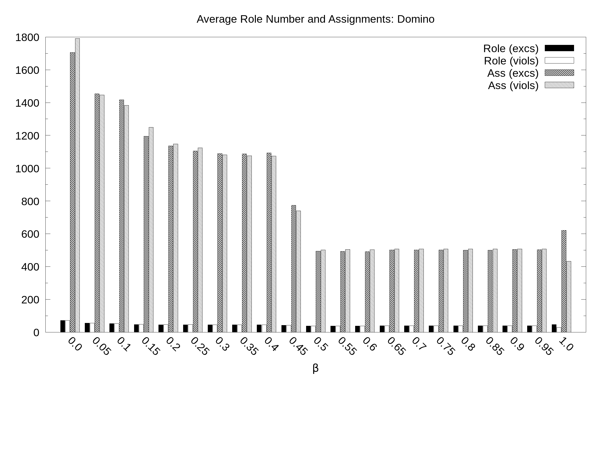
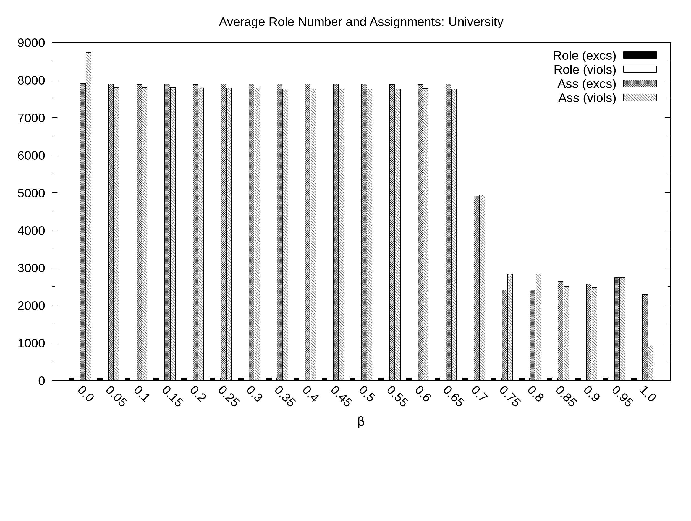
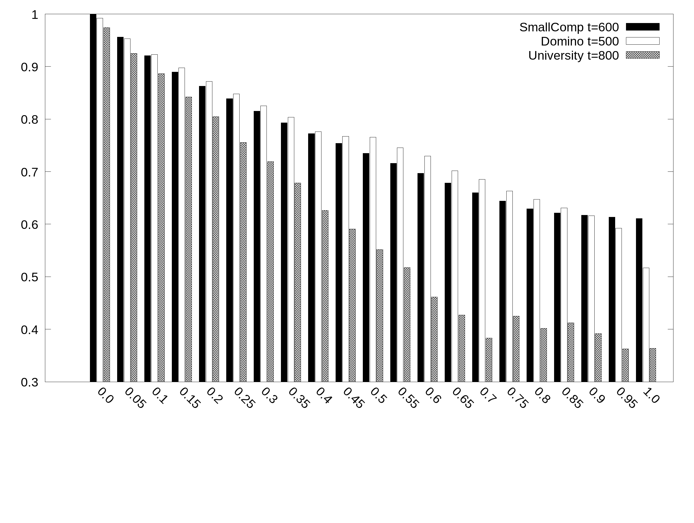
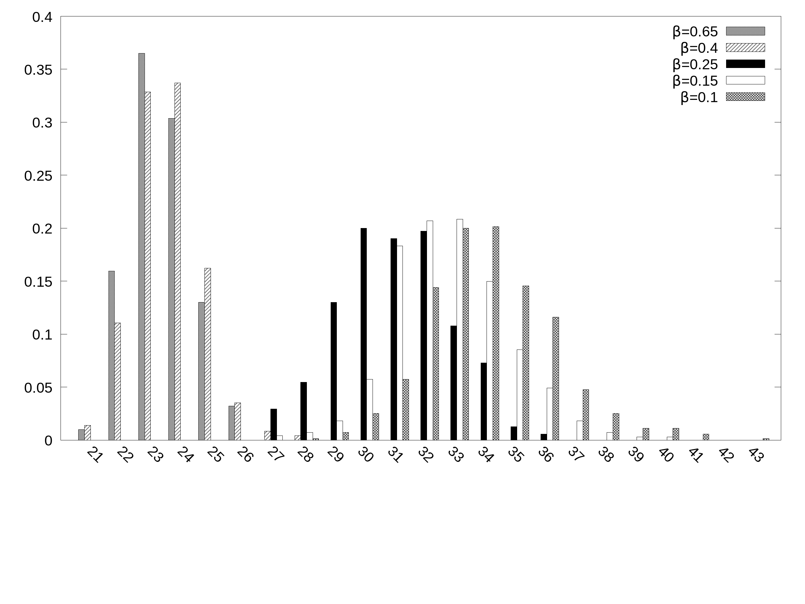

 This work is licensed under a <a rel="license" href="http://creativecommons.org/licenses/by/4.0/">Creative Commons Attribution 4.0 International License</a>.

# On the Use of Max-SAT and PDDL in RBAC Maintenance

This web site contains the dataset and experimental results partially illustrated within the manuscript "On the Use of Max-SAT and PDDL  in RBAC Maintenance" which has been submitted to the Cybersecurity journal.

# Datasets: Single Exceptions/Violations

## SmallComp

Dataset generated by simplyfing the paper working example to obtain optimal solution with a wide range of B values thus enabling the comparison with sub-otpimal solvers

|Input| Link|  	   
|:-:	           |:---:	|
|Permission-to-User | [UPA](dataset/SC/UPA.txt)|
|User-to-role      |[UA](dataset/SC/UA.txt)  |
|Permission-to-Role | [PA](dataset/SC/PA.txt) |
|Exception List           | [excs](dataset/SC/excs.txt)|
|Violation List           | [viols](dataset/SC/viols.txt)|

<!---[1](dataset/D/UPA.txt), [2](dataset/D/UPA.txt), [3](dataset/D/UPA.txt), [4](dataset/D/UPA.txt), [5](dataset/D/UPA.txt), [6](dataset/D/UPA.txt), [7](dataset/D/UPA.txt), [8](dataset/D/UPA.txt), [9](dataset/D/UPA.txt), [10](dataset/D/UPA.txt), [11](dataset/D/UPA.txt), [12](dataset/D/UPA.txt), [13](dataset/D/UPA.txt), [14](dataset/D/UPA.txt), [15](dataset/D/UPA.txt), [16](dataset/D/UPA.txt), [17](dataset/D/UPA.txt), [18](dataset/D/UPA.txt), [19](dataset/D/UPA.txt), [20](dataset/D/UPA.txt), [21](dataset/D/UPA.txt), [22](dataset/D/UPA.txt), [22](dataset/D/UPA.txt), [23](dataset/D/UPA.txt), [24](dataset/D/UPA.txt), [25](dataset/D/UPA.txt), [26](dataset/D/UPA.txt), [27](dataset/D/UPA.txt), [28](dataset/D/UPA.txt), [1](dataset/D/UPA.txt), [1](dataset/D/UPA.txt), [1](dataset/D/UPA.txt), [1](dataset/D/UPA.txt), [1](dataset/D/UPA.txt), [1](dataset/D/UPA.txt), [1](dataset/D/UPA.txt), [1](dataset/D/UPA.txt), [1](dataset/D/UPA.txt), [1](dataset/D/UPA.txt), [1](dataset/D/UPA.txt), [1](dataset/D/UPA.txt), [1](dataset/D/UPA.txt), [1](dataset/D/UPA.txt), [1](dataset/D/UPA.txt), [1](dataset/D/UPA.txt), [1](dataset/D/UPA.txt), [1](dataset/D/UPA.txt), [1](dataset/D/UPA.txt), [1](dataset/D/UPA.txt), [1](dataset/D/UPA.txt), [1](dataset/D/UPA.txt), [1](dataset/D/UPA.txt), [1](dataset/D/UPA.txt), [1](dataset/D/UPA.txt), [1](dataset/D/UPA.txt), [1](dataset/D/UPA.txt), [1](dataset/D/UPA.txt), [1](dataset/D/UPA.txt), [1](dataset/D/UPA.txt), [1](dataset/D/UPA.txt), [1](dataset/D/UPA.txt), [1](dataset/D/UPA.txt), [1](dataset/D/UPA.txt), [1](dataset/D/UPA.txt), [1](dataset/D/UPA.txt), [1](dataset/D/UPA.txt), [1](dataset/D/UPA.txt), [1](dataset/D/UPA.txt), [1](dataset/D/UPA.txt), [1](dataset/D/UPA.txt)
-->
Exceptions: [All Max-SAT Formulas](https://www.dropbox.com/s/3mfsvi3sos8z3wc/small_comp.tar?dl=0)

Violations: [All Max-SAT Formulas](https://www.dropbox.com/s/xnfuvguzq82kesz/small_comp_viols.tar?dl=0)

## Domino

Dataset benchmark used in Role-mining literature obtained from the user access profiles of the Lotus Domino Server.

|Input| Link|  	   
|:-:	           |:---:	|
|Permission-to-User | [UPA](dataset/D/UPA.txt)|
|User-to-role      |[UA](dataset/D/UA.txt)  |
|Permission-to-Role | [PA](dataset/D/PA.txt) |
|Exception List           | [excs](dataset/D/excs.txt)|
|Violation List           | [viols](dataset/D/viols.txt)|

Exceptions: [All Max-SAT Formulas](https://www.dropbox.com/s/nqeygseycj675ze/domino.tar?dl=0)

Violations: [All Max-SAT Formulas](https://www.dropbox.com/s/pnxm9pqsext6frq/domino_viols.tar?dl=0)

## University

Dataset benchmark used in Role-ming literature generated from a template at the Stony Brook University.

|Input| Link|  	   
|:-:	           |:---:	|
|Permission-to-User | [UPA](dataset/U/UPA.txt)|
|User-to-role      |[UA](dataset/U/UA.txt)  |
|Permission-to-Role | [PA](dataset/U/PA.txt) |
|Exception List           | [excs](dataset/U/excs.txt)|
|Violation List           | [viols](dataset/U/viols.txt)|

Exceptions: [All Max-SAT Formulas](https://www.dropbox.com/s/i41n16f6mh2g6yg/university.tar?dl=0)

Violations: [All Max-SAT Formulas](https://www.dropbox.com/s/7q3he9lgrsunq2s/university_viols.tar?dl=0)

## Firewall1

Dataset benchmark used in Role-ming literature representing policies implemented though firewalls used to provide external users access to internal resources.

|Input| Link|  	   
|:-:	           |:---:	|
|Permission-to-User | [UPA](dataset/F/UPA.txt)|
|User-to-role      |[UA](dataset/F/UA.txt)  |
|Permission-to-Role | [PA](dataset/F/PA.txt) |
|Exception List           | [excs](dataset/F/excs.txt)|
|Violation List           | [viols](dataset/F/viols.txt)|

Exceptions - Max-SAT Formulas: [1](https://www.dropbox.com/s/p8eo8sdea5as5k6/b_0.0_exc_0_inputMaxSATSolver.cnf?dl=0),[2](https://www.dropbox.com/s/57kxc71u7hmj66p/b_0.05_exc_0_inputMaxSATSolver.cnf?dl=0),[3](https://www.dropbox.com/s/0ltn0q10fjafsio/b_0.1_exc_0_inputMaxSATSolver.cnf?dl=0),[4](https://www.dropbox.com/s/tnh49eldrd8ock6/b_0.15_exc_0_inputMaxSATSolver.cnf?dl=0),[5](https://www.dropbox.com/s/77408powt0rhjqy/b_0.2_exc_0_inputMaxSATSolver.cnf?dl=0),[6](https://www.dropbox.com/s/z91wnshkym1dhsa/b_0.25_exc_0_inputMaxSATSolver.cnf?dl=0),[7](https://www.dropbox.com/s/ao84auzzcz9byys/b_0.3_exc_0_inputMaxSATSolver.cnf?dl=0),[8](https://www.dropbox.com/s/m6y3mvpf5321rs3/b_0.35_exc_0_inputMaxSATSolver.cnf?dl=0),[9](https://www.dropbox.com/s/71x4xb8np38jm2b/b_0.4_exc_0_inputMaxSATSolver.cnf?dl=0),[10](https://www.dropbox.com/s/yit0eocwehi81sl/b_0.45_exc_0_inputMaxSATSolver.cnf?dl=0),[11](https://www.dropbox.com/s/jam177dd5vtucvk/b_0.5_exc_0_inputMaxSATSolver.cnf?dl=0),[12](https://www.dropbox.com/s/hth1gfgj6kpzl5h/b_0.55_exc_0_inputMaxSATSolver.cnf?dl=0),[13](https://www.dropbox.com/s/725k90rh4tztbib/b_0.6_exc_0_inputMaxSATSolver.cnf?dl=0),[14](https://www.dropbox.com/s/daxw9w38uqjjflh/b_0.65_exc_0_inputMaxSATSolver.cnf?dl=0),[15](https://www.dropbox.com/s/1fvriy2q15rqwwt/b_0.7_exc_0_inputMaxSATSolver.cnf?dl=0),[16](https://www.dropbox.com/s/0dgil6atd6vrr6w/b_0.75_exc_0_inputMaxSATSolver.cnf?dl=0),[17](https://www.dropbox.com/s/kon53ub3sfjbfwy/b_0.8_exc_0_inputMaxSATSolver.cnf?dl=0),[18](https://www.dropbox.com/s/fdsyuba7rmhconx/b_0.85_exc_0_inputMaxSATSolver.cnf?dl=0),[19](https://www.dropbox.com/s/12tuc4lpiqd476j/b_0.9_exc_0_inputMaxSATSolver.cnf?dl=0),[20](https://www.dropbox.com/s/sjjtc6zigavbxnr/b_0.95_exc_0_inputMaxSATSolver.cnf?dl=0),[21](https://www.dropbox.com/s/dw7sooz5of16u2p/b_1.0_exc_0_inputMaxSATSolver.cnf?dl=0)

Violations - Max-SAT Formulas: [1](https://www.dropbox.com/s/0ecysoyiuaiq6u9/exc_0_beta_0.0_inputMaxSATSolver.cnf?dl=0),[2](https://www.dropbox.com/s/orpnh3j00lky1uo/exc_0_beta_0.05_inputMaxSATSolver.cnf?dl=0),[3](https://www.dropbox.com/s/znrwtr1vp2vpuoa/exc_0_beta_0.1_inputMaxSATSolver.cnf?dl=0),[4](https://www.dropbox.com/s/fx57sibq8odpn14/exc_0_beta_0.15_inputMaxSATSolver.cnf?dl=0),[5](https://www.dropbox.com/s/wf82e3gxed615mz/exc_0_beta_0.2_inputMaxSATSolver.cnf?dl=0),[6](https://www.dropbox.com/s/7otfdmwv624l48u/exc_0_beta_0.25_inputMaxSATSolver.cnf?dl=0),[7](https://www.dropbox.com/s/fbdo86w9tr9ubr1/exc_0_beta_0.3_inputMaxSATSolver.cnf?dl=0),[8](https://www.dropbox.com/s/r3jixcfrq5qcue8/exc_0_beta_0.35_inputMaxSATSolver.cnf?dl=0),[9](https://www.dropbox.com/s/x4ky8j9h5lh53rs/exc_0_beta_0.4_inputMaxSATSolver.cnf?dl=0),[10](https://www.dropbox.com/s/3o6k1z51s888201/exc_0_beta_0.45_inputMaxSATSolver.cnf?dl=0),[11](https://www.dropbox.com/s/o1rjzmjbcxzra6s/exc_0_beta_0.5_inputMaxSATSolver.cnf?dl=0),[12](https://www.dropbox.com/s/wb8fu1ywao8b4d3/exc_0_beta_0.55_inputMaxSATSolver.cnf?dl=0),[13](https://www.dropbox.com/s/bxs9nfilrubtqx4/exc_0_beta_0.6_inputMaxSATSolver.cnf?dl=0),[14](https://www.dropbox.com/s/fc4dtkkxx0cavnb/exc_0_beta_0.65_inputMaxSATSolver.cnf?dl=0),[15](https://www.dropbox.com/s/o06vwbdnlpfr4o9/exc_0_beta_0.7_inputMaxSATSolver.cnf?dl=0),[16](https://www.dropbox.com/s/an2huasqa6zvkdc/exc_0_beta_0.75_inputMaxSATSolver.cnf?dl=0),[17](https://www.dropbox.com/s/ro54qjc1x7ucgnz/exc_0_beta_0.8_inputMaxSATSolver.cnf?dl=0),[18](https://www.dropbox.com/s/i79y7mdcrpglmg9/exc_0_beta_0.85_inputMaxSATSolver.cnf?dl=0),[19](https://www.dropbox.com/s/3922ydk57u78boo/exc_0_beta_0.9_inputMaxSATSolver.cnf?dl=0),[20](https://www.dropbox.com/s/u8xzc7agmrodqdx/exc_0_beta_0.95_inputMaxSATSolver.cnf?dl=0),[21](https://www.dropbox.com/s/3nsejobihdrm5a2/exc_0_beta_1.0_inputMaxSATSolver.cnf?dl=0)

<!---[1](dataset/D/UPA.txt), [2](dataset/D/UPA.txt), [3](dataset/D/UPA.txt), [4](dataset/D/UPA.txt), [5](dataset/D/UPA.txt), [6](dataset/D/UPA.txt), [7](dataset/D/UPA.txt), [8](dataset/D/UPA.txt), [9](dataset/D/UPA.txt), [10](dataset/D/UPA.txt), [11](dataset/D/UPA.txt), [12](dataset/D/UPA.txt), [13](dataset/D/UPA.txt), [14](dataset/D/UPA.txt), [15](dataset/D/UPA.txt), [16](dataset/D/UPA.txt), [17](dataset/D/UPA.txt), [18](dataset/D/UPA.txt), [19](dataset/D/UPA.txt), [20](dataset/D/UPA.txt), [21](dataset/D/UPA.txt), [22](dataset/D/UPA.txt), [22](dataset/D/UPA.txt), [23](dataset/D/UPA.txt), [24](dataset/D/UPA.txt), [25](dataset/D/UPA.txt), [26](dataset/D/UPA.txt), [27](dataset/D/UPA.txt), [28](dataset/D/UPA.txt), [1](dataset/D/UPA.txt), [1](dataset/D/UPA.txt), [1](dataset/D/UPA.txt), [1](dataset/D/UPA.txt), [1](dataset/D/UPA.txt), [1](dataset/D/UPA.txt), [1](dataset/D/UPA.txt), [1](dataset/D/UPA.txt), [1](dataset/D/UPA.txt), [1](dataset/D/UPA.txt), [1](dataset/D/UPA.txt), [1](dataset/D/UPA.txt), [1](dataset/D/UPA.txt), [1](dataset/D/UPA.txt), [1](dataset/D/UPA.txt), [1](dataset/D/UPA.txt), [1](dataset/D/UPA.txt), [1](dataset/D/UPA.txt), [1](dataset/D/UPA.txt), [1](dataset/D/UPA.txt), [1](dataset/D/UPA.txt), [1](dataset/D/UPA.txt), [1](dataset/D/UPA.txt), [1](dataset/D/UPA.txt), [1](dataset/D/UPA.txt), [1](dataset/D/UPA.txt), [1](dataset/D/UPA.txt), [1](dataset/D/UPA.txt), [1](dataset/D/UPA.txt), [1](dataset/D/UPA.txt), [1](dataset/D/UPA.txt), [1](dataset/D/UPA.txt), [1](dataset/D/UPA.txt), [1](dataset/D/UPA.txt), [1](dataset/D/UPA.txt), [1](dataset/D/UPA.txt), [1](dataset/D/UPA.txt), [1](dataset/D/UPA.txt), [1](dataset/D/UPA.txt), [1](dataset/D/UPA.txt), [1](dataset/D/UPA.txt)
-->

# Selection of a Max-SAT solver

## Complete Solvers

|Solver  	       |SmallComp  |Domino   	 |University   	|Firewall1   	|   	
|:-:	           |:---:	|:---:	|:---:	|:---:	|
|_Maximo_   	   |[B<=0.5](complete/SC/maximo/Results.txt)   	   |[B=0](complete/D/maximo/Results.txt)    	  |[B=0](complete/U/maximo/Results.txt)   	| [B=0](complete/F/maximo/Results.txt)   	|   	
|_MaxHS_   	     |[B<=0.4](complete/SC/maxhs/Results.txt)     	   |[B=0](complete/D/maxhs/Results.txt)   	      |[B=0](complete/U/maxhs/Results.txt)    	|  -  	|   	
|_LMHS_ |[B<=0.3](complete/SC/lmhs/Results.txt) | [B=0](complete/D/lmhs/Results.txt)   |  [B=0](complete/D/lmhs/Results.txt)  	|  - 	|   
|_Ahmaxsat_   	 |[B<=0.25](complete/SC/ahmaxsat/Results.txt)   	 |- | -  	|  - 	|   	

## Incomplete Solvers

### Time complexity based on Firewall1 variant

90 online fixing instances of increasing size have been generated from _Firewall1_ by selecting more and more of its users (i.e., rows); each instance is associated with a single exception to incorporate and generates a Max-SAT encoding of growing size.

|Number of users (CNF formula size)|UA|PA|exc|
|:---:|:---:|:---:|:---:|
|5 users (0.3 MB)|[UA](dataset/complexity/89/UA.txt)|[PA](dataset/complexity/89/PA.txt)|[exc](dataset/complexity/89/excs.txt)|
|21 users (5.1 MB)|[UA](dataset/complexity/85/UA.txt)|[PA](dataset/complexity/85/PA.txt)|[exc](dataset/complexity/85/excs.txt)|
|37 users (11.3 MB)|[UA](dataset/complexity/81/UA.txt)|[PA](dataset/complexity/81/PA.txt)|[exc](dataset/complexity/81/excs.txt)|
|53 users (27.5 MB)|[UA](dataset/complexity/77/UA.txt)|[PA](dataset/complexity/77/PA.txt)|[exc](dataset/complexity/77/excs.txt)|
|69 users (54.9 MB)|[UA](dataset/complexity/73/UA.txt)|[PA](dataset/complexity/73/PA.txt)|[exc](dataset/complexity/73/excs.txt)|
|85 users (79.6 MB)|[UA](dataset/complexity/69/UA.txt)|[PA](dataset/complexity/69/PA.txt)|[exc](dataset/complexity/69/excs.txt)|
|101 users (120.1 MB)|[UA](dataset/complexity/65/UA.txt)|[PA](dataset/complexity/65/PA.txt)|[exc](dataset/complexity/65/excs.txt)|
|117 users (162.4 MB)|[UA](dataset/complexity/61/UA.txt)|[PA](dataset/complexity/61/PA.txt)|[exc](dataset/complexity/61/excs.txt)|
|133 users (231.7 MB)|[UA](dataset/complexity/57/UA.txt)|[PA](dataset/complexity/57/PA.txt)|[exc](dataset/complexity/57/excs.txt)|
|149 users (300.9 MB)|[UA](dataset/complexity/53/UA.txt)|[PA](dataset/complexity/53/PA.txt)|[exc](dataset/complexity/53/excs.txt)|
|165 users (337.2 MB)|[UA](dataset/complexity/49/UA.txt)|[PA](dataset/complexity/49/PA.txt)|[exc](dataset/complexity/49/excs.txt)|
|181 users (380.7 MB)|[UA](dataset/complexity/45/UA.txt)|[PA](dataset/complexity/45/PA.txt)|[exc](dataset/complexity/45/excs.txt)|
|197 users (519.1 MB)|[UA](dataset/complexity/41/UA.txt)|[PA](dataset/complexity/41/PA.txt)|[exc](dataset/complexity/41/excs.txt)|

The following figure shows the minimum timeout needed (y axis) to obtain a feasible solution for these inputs as a function of their size (x axis) with [B=0.8](complexity/Results.txt).

### Quality of incomplete solutions

Experiment based on _SmallComp_ dataset to measure the ability of the incomplete solver adopted to satisfy the soft constraints. In particular, this is computed as the average weight of satisfied soft constraints over the total sum of weights for the 12 exceptions.

Average percentage of satisfied soft clauses (y axis) as a function of the balance B (x_axis) in the _SmallComp_ dataset:

Results are also available in plain text in [rates.txt](qualityIncompleteMaintenance/rates.txt) which are based on the evalaution of the three configurations:
- complete solver [Results_Complete.txt](qualityIncompleteMaintenance/Results.txt)
- incomplete solver (timeout 2 sec) [Results_t=2.txt](qualityIncompleteMaintenance/2/Results.txt)
- incomplete solver (timeout 180 sec) [Results_t=180.txt](qualityIncompleteMaintenance//180/Results.txt)

# Experimental Results: Single Exceptions/Violations

## Impact of Beta

By adopting CCEHC Max-SAT solver we asses experimentally the impact of balance B to **sim** (similarity) and **spt** (simplicity) for three dataset. We considered both single exceptions and single violations to inlcude in the initial RBAC state.

Results for additions of exceptions

- [SmallComp](preferencesImpactMaintenance/Avg_CS/Avg_quality_smallcomp_exc.dat)
- [Domino](preferencesImpactMaintenance/Avg_CS/Avg_quality_domino_exc.dat)
- [University](preferencesImpactMaintenance/Avg_CS/Avg_quality_university_exc.dat)

Results for removal of violations

- [SmallComp](preferencesImpactMaintenance/Avg_CS/Avg_quality_smallcomp_viol.dat)
- [Domino](preferencesImpactMaintenance/Avg_CS/Avg_quality_domino_viol.dat)
- [University](preferencesImpactMaintenance/Avg_CS/Avg_quality_university_viol.dat)

**SmallComp**. Average simplicity and similarity (y axis) as a function of the balance B (x axis) with 21 values of B sampled at regular intervals:

**SmallComp**. Average number of roles and assignments (y axis) as a function of the balance B (x axis) with 21 values of B sampled at regular intervals:

**Domino**. Average simplicity and similarity (y axis) as a function of the balance B (x axis) with 21 values of B sampled at regular intervals:

**Domino**. Average number of roles and assignments (y axis) as a function of the balance B (x axis) with 21 values of B sampled at regular intervals:

**University**. Average simplicity and similarity (y axis) as a function of the balance B (x axis) with 21 values of B sampled at regular intervals:

**University**. Average number of roles and assignments (y axis) as a function of the balance B (x axis) with 21 values of B sampled at regular intervals:

**Satisfied soft constraints**. Average percentage of satisfied weights (y axis) depending on the balance B (x axis):

## Impact of timeout

Results collected in the following are obtained starting from _Domino_ to show the impact of the timeout with three different balance configurations:

- [B = 0.65](timeImpactMaintenance/AVG_Quality_b0.65.dat)
- [B = 0.45](timeImpactMaintenance/AVG_Quality_b0.45.dat)
- [B = 0.25](timeImpactMaintenance/AVG_Quality_b0.25.dat)
- [B = 0.10](timeImpactMaintenance/AVG_Quality_b0.1.dat)
- [B = 0.05](timeImpactMaintenance/AVG_Quality_b0.05.dat)

Average simplicity in Domino (y axis) as a function of the timeout (x axis, secs) at different balance points B.

Average similarity in Domino (y axis) as a function of the timeout (x axis, secs) at different balance points B.

## The order of exceptions with a variant of _Domino_ dataset

We picked a string of 6 exceptions to be incorporated.

|Input| Link|  	   
|:-:	           |:---:	|
|Permission-to-User | [UPA](dataset/permutations/UPA.txt)|
|User-to-role      |[UA](dataset/permutations/UA.txt)  |
|Permission-to-Role | [PA](dataset/permutations/PA.txt) |
|Exception List           | [excs](dataset/permutations/excs.txt)|

We generated all the 720 permutations as possibly different incorporating sequences. We fix each sequence and collected at each our metrics (715/720 paths considered as solvable in less than 60 seconds).

In the following is reported the distribution of the final number of roles obtained at different B values.

Corresponding input data are also available in the following:

- [B = 0.65](permutazioniMaintenance/0.65/RolesOcc_0.65_timeout_10.dat)
- [B = 0.4](permutazioniMaintenance/0.4/RolesOcc_0.4_timeout_10.dat)
- [B = 0.25](permutazioniMaintenance/0.25/RolesOcc_0.25_timeout_10.dat)
- [B = 0.15](permutazioniMaintenance/0.15/RolesOcc_0.15_timeout_10.dat)
- [B = 0.1](permutazioniMaintenance/0.1/RolesOcc_0.1_timeout_10.dat)

# Datasets for Comparison
These benchamrks have been adopted to compare our approach (RMS) with Fast Miner (FM) and Minimal Perturbation (MP) role mining algorithms. The initial RBAC state has been created with Pair Count role mining algorithm.

## SmallComp

|Input| Link|  	   
|:-:	           |:---:	|
|Permission-to-User | [UPA](datasetComp/SC/UPA.txt)|
|User-to-role      |[UA](datasetComp/SC/UA.txt)  |
|Permission-to-Role | [PA](datasetComp/SC/PA.txt) |
|Exception List           | [excs](datasetComp/SC/excs.txt)|
|Violation List           | [viols](datasetComp/SC/viols.txt)|

## Domino

|Input| Link|  	   
|:-:	           |:---:	|
|Permission-to-User | [UPA](datasetComp/D/UPA.txt)|
|User-to-role      |[UA](datasetComp/D/UA.txt)  |
|Permission-to-Role | [PA](datasetComp/D/PA.txt) |
|Exception List           | [excs](datasetComp/D/excs.txt)|
|Violation List           | [viols](datasetComp/D/viols.txt)|

## University

|Input| Link|  	   
|:-:	           |:---:	|
|Permission-to-User | [UPA](datasetComp/U/UPA.txt)|
|User-to-role      |[UA](datasetComp/U/UA.txt)  |
|Permission-to-Role | [PA](datasetComp/U/PA.txt) |
|Exception List           | [excs](datasetComp/U/excs.txt)|
|Violation List           | [viols](datasetComp/U/viols.txt)|

# Comparison Results

Solutions obtained for the above benchmarks by using FM, MP, and RMS (timeout=1200 sec) to perform RBAC maintenance tasks. For RMS, solutions are evaluate with 11 values of B sampled at regular intervals. Solutions are positioned according to their average simplicity (x axis) and similarity (y axis).

## SmallComp

Corresponding input data are also available in the following:

- [RMS_smallcomp](comp/comparison1200toy.txt)
- [FM_smallcomp](comp/global_metric_toy_FM.txt)
- [MP_smallcomp](comp/global_metric_toy_MP.txt)

## Domino

Corresponding input data are also available in the following:

- [RMS_domino](comp/comparison1200domino.txt)
- [FM_domino](comp/global_metric_domino_FM.txt)
- [MP_domino](comp/global_metric_domino_MP.txt)

## University

Corresponding input data are also available in the following:

- [RMS_university](comp/comparison1200university.txt)
- [FM_university](comp/global_metric_university_large_FM.txt)
- [MP_university](comp/global_metric_university_large_MP.txt)

# Datasets: Multiple Exceptions/Violations

These benchmarks have been adopted to prove the ability of our algorithms in including lists of exceptions and violations in one single step. Sequences of exceptions and violations (10 runs) have been pseudo-randomly generated according to a specific Markov chain model.

## SmallComp

|Run|UA|PA|Excs|Viols|
|:-:	           |:---:	|:---:	|:---:	|:---:	|
|0|[UA](dataset_multipleviolation/SC/0/UA.txt)|[PA](dataset_multipleviolation/SC/0/PA.txt)|[excs](dataset_multipleviolation/SC/0/excs.txt)|[viols](dataset_multipleviolation/SC/0/viols.txt)|
|1|[UA](dataset_multipleviolation/SC/1/UA.txt)|[PA](dataset_multipleviolation/SC/1/PA.txt)|[excs](dataset_multipleviolation/SC/1/excs.txt)|[viols](dataset_multipleviolation/SC/1/viols.txt)|
|2|[UA](dataset_multipleviolation/SC/2/UA.txt)|[PA](dataset_multipleviolation/SC/2/PA.txt)|[excs](dataset_multipleviolation/SC/2/excs.txt)|[viols](dataset_multipleviolation/SC/2/viols.txt)|
|3|[UA](dataset_multipleviolation/SC/3/UA.txt)|[PA](dataset_multipleviolation/SC/3/PA.txt)|[excs](dataset_multipleviolation/SC/3/excs.txt)|[viols](dataset_multipleviolation/SC/3/viols.txt)|
|4|[UA](dataset_multipleviolation/SC/4/UA.txt)|[PA](dataset_multipleviolation/SC/4/PA.txt)|[excs](dataset_multipleviolation/SC/4/excs.txt)|[viols](dataset_multipleviolation/SC/4/viols.txt)|
|5|[UA](dataset_multipleviolation/SC/5/UA.txt)|[PA](dataset_multipleviolation/SC/5/PA.txt)|[excs](dataset_multipleviolation/SC/5/excs.txt)|[viols](dataset_multipleviolation/SC/5/viols.txt)|
|6|[UA](dataset_multipleviolation/SC/6/UA.txt)|[PA](dataset_multipleviolation/SC/6/PA.txt)|[excs](dataset_multipleviolation/SC/6/excs.txt)|[viols](dataset_multipleviolation/SC/6/viols.txt)|
|7|[UA](dataset_multipleviolation/SC/7/UA.txt)|[PA](dataset_multipleviolation/SC/7/PA.txt)|[excs](dataset_multipleviolation/SC/7/excs.txt)|[viols](dataset_multipleviolation/SC/7/viols.txt)|
|8|[UA](dataset_multipleviolation/SC/8/UA.txt)|[PA](dataset_multipleviolation/SC/8/PA.txt)|[excs](dataset_multipleviolation/SC/8/excs.txt)|[viols](dataset_multipleviolation/SC/8/viols.txt)|
|9|[UA](dataset_multipleviolation/SC/9/UA.txt)|[PA](dataset_multipleviolation/SC/9/PA.txt)|[excs](dataset_multipleviolation/SC/9/excs.txt)|[viols](dataset_multipleviolation/SC/9/viols.txt)|

[All Max-SAT Formulas](https://www.dropbox.com/s/5ldrevtuwpuc7e9/role_smallcomp_multiple.zip?dl=0)

## Domino

|Run|UA|PA|Excs|Viols|
|:---:|:---:|:---:|:---:|:---:|
|0|[UA](dataset_multipleviolation/D/0/UA.txt)|[PA](dataset_multipleviolation/D/0/PA.txt)|[excs](dataset_multipleviolation/D/0/excs.txt)|[viols](dataset_multipleviolation/D/0/viols.txt)|
|1|[UA](dataset_multipleviolation/D/1/UA.txt)|[PA](dataset_multipleviolation/D/1/PA.txt)|[excs](dataset_multipleviolation/D/1/excs.txt)|[viols](dataset_multipleviolation/D/1/viols.txt)|
|2|[UA](dataset_multipleviolation/D/2/UA.txt)|[PA](dataset_multipleviolation/D/2/PA.txt)|[excs](dataset_multipleviolation/D/2/excs.txt)|[viols](dataset_multipleviolation/D/2/viols.txt)|
|3|[UA](dataset_multipleviolation/D/3/UA.txt)|[PA](dataset_multipleviolation/D/3/PA.txt)|[excs](dataset_multipleviolation/D/3/excs.txt)|[viols](dataset_multipleviolation/D/3/viols.txt)|
|4|[UA](dataset_multipleviolation/D/4/UA.txt)|[PA](dataset_multipleviolation/D/4/PA.txt)|[excs](dataset_multipleviolation/D/4/excs.txt)|[viols](dataset_multipleviolation/D/4/viols.txt)|
|5|[UA](dataset_multipleviolation/D/5/UA.txt)|[PA](dataset_multipleviolation/D/5/PA.txt)|[excs](dataset_multipleviolation/D/5/excs.txt)|[viols](dataset_multipleviolation/D/5/viols.txt)|
|6|[UA](dataset_multipleviolation/D/6/UA.txt)|[PA](dataset_multipleviolation/D/6/PA.txt)|[excs](dataset_multipleviolation/D/6/excs.txt)|[viols](dataset_multipleviolation/D/6/viols.txt)|
|7|[UA](dataset_multipleviolation/D/7/UA.txt)|[PA](dataset_multipleviolation/D/7/PA.txt)|[excs](dataset_multipleviolation/D/7/excs.txt)|[viols](dataset_multipleviolation/D/7/viols.txt)|
|8|[UA](dataset_multipleviolation/D/8/UA.txt)|[PA](dataset_multipleviolation/D/8/PA.txt)|[excs](dataset_multipleviolation/D/8/excs.txt)|[viols](dataset_multipleviolation/D/8/viols.txt)|
|9|[UA](dataset_multipleviolation/D/9/UA.txt)|[PA](dataset_multipleviolation/D/9/PA.txt)|[excs](dataset_multipleviolation/D/9/excs.txt)|[viols](dataset_multipleviolation/D/9/viols.txt)|

[All Max-SAT Formulas](https://www.dropbox.com/s/d0e2excx6zf86fo/role_domino_multiple.zip?dl=0)

## University

|Run|UA|PA|Excs|Viols|
|:-:	           |:---:	|:---:	|:---:	|:---:	|
|0|[UA](dataset_multipleviolation/U/0/UA.txt)|[PA](dataset_multipleviolation/U/0/PA.txt)|[excs](dataset_multipleviolation/U/0/excs.txt)|[viols](dataset_multipleviolation/U/0/viols.txt)|
|1|[UA](dataset_multipleviolation/U/1/UA.txt)|[PA](dataset_multipleviolation/U/1/PA.txt)|[excs](dataset_multipleviolation/U/1/excs.txt)|[viols](dataset_multipleviolation/U/1/viols.txt)|
|2|[UA](dataset_multipleviolation/U/2/UA.txt)|[PA](dataset_multipleviolation/U/2/PA.txt)|[excs](dataset_multipleviolation/U/2/excs.txt)|[viols](dataset_multipleviolation/U/2/viols.txt)|
|3|[UA](dataset_multipleviolation/U/3/UA.txt)|[PA](dataset_multipleviolation/U/3/PA.txt)|[excs](dataset_multipleviolation/U/3/excs.txt)|[viols](dataset_multipleviolation/U/3/viols.txt)|
|4|[UA](dataset_multipleviolation/U/4/UA.txt)|[PA](dataset_multipleviolation/U/4/PA.txt)|[excs](dataset_multipleviolation/U/4/excs.txt)|[viols](dataset_multipleviolation/U/4/viols.txt)|
|5|[UA](dataset_multipleviolation/U/5/UA.txt)|[PA](dataset_multipleviolation/U/5/PA.txt)|[excs](dataset_multipleviolation/U/5/excs.txt)|[viols](dataset_multipleviolation/U/5/viols.txt)|
|6|[UA](dataset_multipleviolation/U/6/UA.txt)|[PA](dataset_multipleviolation/U/6/PA.txt)|[excs](dataset_multipleviolation/U/6/excs.txt)|[viols](dataset_multipleviolation/U/6/viols.txt)|
|7|[UA](dataset_multipleviolation/U/7/UA.txt)|[PA](dataset_multipleviolation/U/7/PA.txt)|[excs](dataset_multipleviolation/U/7/excs.txt)|[viols](dataset_multipleviolation/U/7/viols.txt)|
|8|[UA](dataset_multipleviolation/U/8/UA.txt)|[PA](dataset_multipleviolation/U/8/PA.txt)|[excs](dataset_multipleviolation/U/8/excs.txt)|[viols](dataset_multipleviolation/U/8/viols.txt)|
|9|[UA](dataset_multipleviolation/U/9/UA.txt)|[PA](dataset_multipleviolation/U/9/PA.txt)|[excs](dataset_multipleviolation/U/9/excs.txt)|[viols](dataset_multipleviolation/U/9/viols.txt)|

[All Max-SAT Formulas](https://www.dropbox.com/s/0y4dbumizahgh8n/role_university_multiple.zip?dl=0)

# Experimental Results: Multiple Exceptions/Violations

Here we asses experimentally multiple exceptions and multiple violations in one single problem instance. We evaluate the impact of balance B to **sim** (similarity) and **spt** (simplicity) for three dataset.

Results for addition/removal of multiple exceptions/violations

- [SmallComp](preferenceImpactMaintenanceMultiple/AVG_solver_toy_t_600_100_p_5.txt)
- [Domino](preferenceImpactMaintenanceMultiple/AVG_solver_domino_t_500_100_p_5.txt)
- [University](preferenceImpactMaintenanceMultiple/AVG_solver_university_large_t_1600_400_p_5.txt)

**SmallComp**. Average simplicity and similarity (y axis) as a function of the balance B (x axis) with 21 values of B sampled at regular intervals:

**Domino**. Average simplicity and similarity (y axis) as a function of the balance B (x axis) with 21 values of B sampled at regular intervals:

**University**. Average simplicity and similarity (y axis) as a function of the balance B (x axis) with 21 values of B sampled at regular intervals:

# Dataset: Planning

These benchmarks have been adopted to prove the ability of our algorithms in generating maintenance plans to include sequences of violations. The latter (10 runs) have been pseudo-randomly generated according to a specific Markov chain model. 
In the following, (I/O) stands for (Input PDDL problem/Output plan) 

## SmallComp

|Beta/Run|Run 0| Run 1|Run 2|Run 3|Run 4|Run 5|Run 6|Run 7|Run 8|Run 9|
|:-:	 |:--:|:---:	|:---:	|:---:	|:---:	| :--:|:-:	           |:---:	|:---:	|:---:	|
|Beta 0.0|[I](dataset_planning/SC/pddlformula/role_smallcomp_planning_0.0_0.pddl)/[O](dataset_planning/SC/outplan/role_smallcomp_output_plan_0.0_0.plan)|[I](dataset_planning/SC/pddlformula/role_smallcomp_planning_0.0_1.pddl)/[O](dataset_planning/SC/outplan/role_smallcomp_output_plan_0.0_1.plan)|[I](dataset_planning/SC/pddlformula/role_smallcomp_planning_0.0_2.pddl)/[O](dataset_planning/SC/outplan/role_smallcomp_output_plan_0.0_2.plan)|[I](dataset_planning/SC/pddlformula/role_smallcomp_planning_0.0_3.pddl)/[O](dataset_planning/SC/outplan/role_smallcomp_output_plan_0.0_3.plan)|[I](dataset_planning/SC/pddlformula/role_smallcomp_planning_0.0_4.pddl)/[O](dataset_planning/SC/outplan/role_smallcomp_output_plan_0.0_4.plan)|[I](dataset_planning/SC/pddlformula/role_smallcomp_planning_0.0_5.pddl)/[O](dataset_planning/SC/outplan/role_smallcomp_output_plan_0.0_5.plan)|[I](dataset_planning/SC/pddlformula/role_smallcomp_planning_0.0_6.pddl)/[O](dataset_planning/SC/outplan/role_smallcomp_output_plan_0.0_6.plan)|[I](dataset_planning/SC/pddlformula/role_smallcomp_planning_0.0_7.pddl)/[O](dataset_planning/SC/outplan/role_smallcomp_output_plan_0.0_7.plan)|[I](dataset_planning/SC/pddlformula/role_smallcomp_planning_0.0_8.pddl)/[O](dataset_planning/SC/outplan/role_smallcomp_output_plan_0.0_8.plan)|[I](dataset_planning/SC/pddlformula/role_smallcomp_planning_0.0_9.pddl)/[O](dataset_planning/SC/outplan/role_smallcomp_output_plan_0.0_9.plan)|
|Beta 0.05|[I](dataset_planning/SC/pddlformula/role_smallcomp_planning_0.05_0.pddl)/[O](dataset_planning/SC/outplan/role_smallcomp_output_plan_0.05_0.plan)|[I](dataset_planning/SC/pddlformula/role_smallcomp_planning_0.05_1.pddl)/[O](dataset_planning/SC/outplan/role_smallcomp_output_plan_0.05_1.plan)|[I](dataset_planning/SC/pddlformula/role_smallcomp_planning_0.05_2.pddl)/[O](dataset_planning/SC/outplan/role_smallcomp_output_plan_0.05_2.plan)|[I](dataset_planning/SC/pddlformula/role_smallcomp_planning_0.05_3.pddl)/[O](dataset_planning/SC/outplan/role_smallcomp_output_plan_0.05_3.plan)|[I](dataset_planning/SC/pddlformula/role_smallcomp_planning_0.05_4.pddl)/[O](dataset_planning/SC/outplan/role_smallcomp_output_plan_0.05_4.plan)|[I](dataset_planning/SC/pddlformula/role_smallcomp_planning_0.05_5.pddl)/[O](dataset_planning/SC/outplan/role_smallcomp_output_plan_0.05_5.plan)|[I](dataset_planning/SC/pddlformula/role_smallcomp_planning_0.05_6.pddl)/[O](dataset_planning/SC/outplan/role_smallcomp_output_plan_0.05_6.plan)|[I](dataset_planning/SC/pddlformula/role_smallcomp_planning_0.05_7.pddl)/[O](dataset_planning/SC/outplan/role_smallcomp_output_plan_0.05_7.plan)|[I](dataset_planning/SC/pddlformula/role_smallcomp_planning_0.05_8.pddl)/[O](dataset_planning/SC/outplan/role_smallcomp_output_plan_0.05_8.plan)|[I](dataset_planning/SC/pddlformula/role_smallcomp_planning_0.05_9.pddl)/[O](dataset_planning/SC/outplan/role_smallcomp_output_plan_0.05_9.plan)|
|Beta 0.1|[I](dataset_planning/SC/pddlformula/role_smallcomp_planning_0.1_0.pddl)/[O](dataset_planning/SC/outplan/role_smallcomp_output_plan_0.1_0.plan)|[I](dataset_planning/SC/pddlformula/role_smallcomp_planning_0.1_1.pddl)/[O](dataset_planning/SC/outplan/role_smallcomp_output_plan_0.1_1.plan)|[I](dataset_planning/SC/pddlformula/role_smallcomp_planning_0.1_2.pddl)/[O](dataset_planning/SC/outplan/role_smallcomp_output_plan_0.1_2.plan)|[I](dataset_planning/SC/pddlformula/role_smallcomp_planning_0.1_3.pddl)/[O](dataset_planning/SC/outplan/role_smallcomp_output_plan_0.1_3.plan)|[I](dataset_planning/SC/pddlformula/role_smallcomp_planning_0.1_4.pddl)/[O](dataset_planning/SC/outplan/role_smallcomp_output_plan_0.1_4.plan)|[I](dataset_planning/SC/pddlformula/role_smallcomp_planning_0.1_5.pddl)/[O](dataset_planning/SC/outplan/role_smallcomp_output_plan_0.1_5.plan)|[I](dataset_planning/SC/pddlformula/role_smallcomp_planning_0.1_6.pddl)/[O](dataset_planning/SC/outplan/role_smallcomp_output_plan_0.1_6.plan)|[I](dataset_planning/SC/pddlformula/role_smallcomp_planning_0.1_7.pddl)/[O](dataset_planning/SC/outplan/role_smallcomp_output_plan_0.1_7.plan)|[I](dataset_planning/SC/pddlformula/role_smallcomp_planning_0.1_8.pddl)/[O](dataset_planning/SC/outplan/role_smallcomp_output_plan_0.1_8.plan)|[I](dataset_planning/SC/pddlformula/role_smallcomp_planning_0.1_9.pddl)/[O](dataset_planning/SC/outplan/role_smallcomp_output_plan_0.1_9.plan)|
|Beta 0.15|[I](dataset_planning/SC/pddlformula/role_smallcomp_planning_0.15_0.pddl)/[O](dataset_planning/SC/outplan/role_smallcomp_output_plan_0.15_0.plan)|[I](dataset_planning/SC/pddlformula/role_smallcomp_planning_0.15_1.pddl)/[O](dataset_planning/SC/outplan/role_smallcomp_output_plan_0.15_1.plan)|[I](dataset_planning/SC/pddlformula/role_smallcomp_planning_0.15_2.pddl)/[O](dataset_planning/SC/outplan/role_smallcomp_output_plan_0.15_2.plan)|[I](dataset_planning/SC/pddlformula/role_smallcomp_planning_0.15_3.pddl)/[O](dataset_planning/SC/outplan/role_smallcomp_output_plan_0.15_3.plan)|[I](dataset_planning/SC/pddlformula/role_smallcomp_planning_0.15_4.pddl)/[O](dataset_planning/SC/outplan/role_smallcomp_output_plan_0.15_4.plan)|[I](dataset_planning/SC/pddlformula/role_smallcomp_planning_0.15_5.pddl)/[O](dataset_planning/SC/outplan/role_smallcomp_output_plan_0.15_5.plan)|[I](dataset_planning/SC/pddlformula/role_smallcomp_planning_0.15_6.pddl)/[O](dataset_planning/SC/outplan/role_smallcomp_output_plan_0.15_6.plan)|[I](dataset_planning/SC/pddlformula/role_smallcomp_planning_0.15_7.pddl)/[O](dataset_planning/SC/outplan/role_smallcomp_output_plan_0.15_7.plan)|[I](dataset_planning/SC/pddlformula/role_smallcomp_planning_0.15_8.pddl)/[O](dataset_planning/SC/outplan/role_smallcomp_output_plan_0.15_8.plan)|[I](dataset_planning/SC/pddlformula/role_smallcomp_planning_0.15_9.pddl)/[O](dataset_planning/SC/outplan/role_smallcomp_output_plan_0.15_9.plan)|
|Beta 0.2|[I](dataset_planning/SC/pddlformula/role_smallcomp_planning_0.2_0.pddl)/[O](dataset_planning/SC/outplan/role_smallcomp_output_plan_0.2_0.plan)|[I](dataset_planning/SC/pddlformula/role_smallcomp_planning_0.2_1.pddl)/[O](dataset_planning/SC/outplan/role_smallcomp_output_plan_0.2_1.plan)|[I](dataset_planning/SC/pddlformula/role_smallcomp_planning_0.2_2.pddl)/[O](dataset_planning/SC/outplan/role_smallcomp_output_plan_0.2_2.plan)|[I](dataset_planning/SC/pddlformula/role_smallcomp_planning_0.2_3.pddl)/[O](dataset_planning/SC/outplan/role_smallcomp_output_plan_0.2_3.plan)|[I](dataset_planning/SC/pddlformula/role_smallcomp_planning_0.2_4.pddl)/[O](dataset_planning/SC/outplan/role_smallcomp_output_plan_0.2_4.plan)|[I](dataset_planning/SC/pddlformula/role_smallcomp_planning_0.2_5.pddl)/[O](dataset_planning/SC/outplan/role_smallcomp_output_plan_0.2_5.plan)|[I](dataset_planning/SC/pddlformula/role_smallcomp_planning_0.2_6.pddl)/[O](dataset_planning/SC/outplan/role_smallcomp_output_plan_0.2_6.plan)|[I](dataset_planning/SC/pddlformula/role_smallcomp_planning_0.2_7.pddl)/[O](dataset_planning/SC/outplan/role_smallcomp_output_plan_0.2_7.plan)|[I](dataset_planning/SC/pddlformula/role_smallcomp_planning_0.2_8.pddl)/[O](dataset_planning/SC/outplan/role_smallcomp_output_plan_0.2_8.plan)|[I](dataset_planning/SC/pddlformula/role_smallcomp_planning_0.2_9.pddl)/[O](dataset_planning/SC/outplan/role_smallcomp_output_plan_0.2_9.plan)|
|Beta 0.25|[I](dataset_planning/SC/pddlformula/role_smallcomp_planning_0.25_0.pddl)/[O](dataset_planning/SC/outplan/role_smallcomp_output_plan_0.25_0.plan)|[I](dataset_planning/SC/pddlformula/role_smallcomp_planning_0.25_1.pddl)/[O](dataset_planning/SC/outplan/role_smallcomp_output_plan_0.25_1.plan)|[I](dataset_planning/SC/pddlformula/role_smallcomp_planning_0.25_2.pddl)/[O](dataset_planning/SC/outplan/role_smallcomp_output_plan_0.25_2.plan)|[I](dataset_planning/SC/pddlformula/role_smallcomp_planning_0.25_3.pddl)/[O](dataset_planning/SC/outplan/role_smallcomp_output_plan_0.25_3.plan)|[I](dataset_planning/SC/pddlformula/role_smallcomp_planning_0.25_4.pddl)/[O](dataset_planning/SC/outplan/role_smallcomp_output_plan_0.25_4.plan)|[I](dataset_planning/SC/pddlformula/role_smallcomp_planning_0.25_5.pddl)/[O](dataset_planning/SC/outplan/role_smallcomp_output_plan_0.25_5.plan)|[I](dataset_planning/SC/pddlformula/role_smallcomp_planning_0.25_6.pddl)/[O](dataset_planning/SC/outplan/role_smallcomp_output_plan_0.25_6.plan)|[I](dataset_planning/SC/pddlformula/role_smallcomp_planning_0.25_7.pddl)/[O](dataset_planning/SC/outplan/role_smallcomp_output_plan_0.25_7.plan)|[I](dataset_planning/SC/pddlformula/role_smallcomp_planning_0.25_8.pddl)/[O](dataset_planning/SC/outplan/role_smallcomp_output_plan_0.25_8.plan)|[I](dataset_planning/SC/pddlformula/role_smallcomp_planning_0.25_9.pddl)/[O](dataset_planning/SC/outplan/role_smallcomp_output_plan_0.25_9.plan)|
|Beta 0.3|[I](dataset_planning/SC/pddlformula/role_smallcomp_planning_0.3_0.pddl)/[O](dataset_planning/SC/outplan/role_smallcomp_output_plan_0.3_0.plan)|[I](dataset_planning/SC/pddlformula/role_smallcomp_planning_0.3_1.pddl)/[O](dataset_planning/SC/outplan/role_smallcomp_output_plan_0.3_1.plan)|[I](dataset_planning/SC/pddlformula/role_smallcomp_planning_0.3_2.pddl)/[O](dataset_planning/SC/outplan/role_smallcomp_output_plan_0.3_2.plan)|[I](dataset_planning/SC/pddlformula/role_smallcomp_planning_0.3_3.pddl)/[O](dataset_planning/SC/outplan/role_smallcomp_output_plan_0.3_3.plan)|[I](dataset_planning/SC/pddlformula/role_smallcomp_planning_0.3_4.pddl)/[O](dataset_planning/SC/outplan/role_smallcomp_output_plan_0.3_4.plan)|[I](dataset_planning/SC/pddlformula/role_smallcomp_planning_0.3_5.pddl)/[O](dataset_planning/SC/outplan/role_smallcomp_output_plan_0.3_5.plan)|[I](dataset_planning/SC/pddlformula/role_smallcomp_planning_0.3_6.pddl)/[O](dataset_planning/SC/outplan/role_smallcomp_output_plan_0.3_6.plan)|[I](dataset_planning/SC/pddlformula/role_smallcomp_planning_0.3_7.pddl)/[O](dataset_planning/SC/outplan/role_smallcomp_output_plan_0.3_7.plan)|[I](dataset_planning/SC/pddlformula/role_smallcomp_planning_0.3_8.pddl)/[O](dataset_planning/SC/outplan/role_smallcomp_output_plan_0.3_8.plan)|[I](dataset_planning/SC/pddlformula/role_smallcomp_planning_0.3_9.pddl)/[O](dataset_planning/SC/outplan/role_smallcomp_output_plan_0.3_9.plan)|
|Beta 0.35|[I](dataset_planning/SC/pddlformula/role_smallcomp_planning_0.35_0.pddl)/[O](dataset_planning/SC/outplan/role_smallcomp_output_plan_0.35_0.plan)|[I](dataset_planning/SC/pddlformula/role_smallcomp_planning_0.35_1.pddl)/[O](dataset_planning/SC/outplan/role_smallcomp_output_plan_0.35_1.plan)|[I](dataset_planning/SC/pddlformula/role_smallcomp_planning_0.35_2.pddl)/[O](dataset_planning/SC/outplan/role_smallcomp_output_plan_0.35_2.plan)|[I](dataset_planning/SC/pddlformula/role_smallcomp_planning_0.35_3.pddl)/[O](dataset_planning/SC/outplan/role_smallcomp_output_plan_0.35_3.plan)|[I](dataset_planning/SC/pddlformula/role_smallcomp_planning_0.35_4.pddl)/[O](dataset_planning/SC/outplan/role_smallcomp_output_plan_0.35_4.plan)|[I](dataset_planning/SC/pddlformula/role_smallcomp_planning_0.35_5.pddl)/[O](dataset_planning/SC/outplan/role_smallcomp_output_plan_0.35_5.plan)|[I](dataset_planning/SC/pddlformula/role_smallcomp_planning_0.35_6.pddl)/[O](dataset_planning/SC/outplan/role_smallcomp_output_plan_0.35_6.plan)|[I](dataset_planning/SC/pddlformula/role_smallcomp_planning_0.35_7.pddl)/[O](dataset_planning/SC/outplan/role_smallcomp_output_plan_0.35_7.plan)|[I](dataset_planning/SC/pddlformula/role_smallcomp_planning_0.35_8.pddl)/[O](dataset_planning/SC/outplan/role_smallcomp_output_plan_0.35_8.plan)|[I](dataset_planning/SC/pddlformula/role_smallcomp_planning_0.35_9.pddl)/[O](dataset_planning/SC/outplan/role_smallcomp_output_plan_0.35_9.plan)|
|Beta 0.4|[I](dataset_planning/SC/pddlformula/role_smallcomp_planning_0.4_0.pddl)/[O](dataset_planning/SC/outplan/role_smallcomp_output_plan_0.4_0.plan)|[I](dataset_planning/SC/pddlformula/role_smallcomp_planning_0.4_1.pddl)/[O](dataset_planning/SC/outplan/role_smallcomp_output_plan_0.4_1.plan)|[I](dataset_planning/SC/pddlformula/role_smallcomp_planning_0.4_2.pddl)/[O](dataset_planning/SC/outplan/role_smallcomp_output_plan_0.4_2.plan)|[I](dataset_planning/SC/pddlformula/role_smallcomp_planning_0.4_3.pddl)/[O](dataset_planning/SC/outplan/role_smallcomp_output_plan_0.4_3.plan)|[I](dataset_planning/SC/pddlformula/role_smallcomp_planning_0.4_4.pddl)/[O](dataset_planning/SC/outplan/role_smallcomp_output_plan_0.4_4.plan)|[I](dataset_planning/SC/pddlformula/role_smallcomp_planning_0.4_5.pddl)/[O](dataset_planning/SC/outplan/role_smallcomp_output_plan_0.4_5.plan)|[I](dataset_planning/SC/pddlformula/role_smallcomp_planning_0.4_6.pddl)/[O](dataset_planning/SC/outplan/role_smallcomp_output_plan_0.4_6.plan)|[I](dataset_planning/SC/pddlformula/role_smallcomp_planning_0.4_7.pddl)/[O](dataset_planning/SC/outplan/role_smallcomp_output_plan_0.4_7.plan)|[I](dataset_planning/SC/pddlformula/role_smallcomp_planning_0.4_8.pddl)/[O](dataset_planning/SC/outplan/role_smallcomp_output_plan_0.4_8.plan)|[I](dataset_planning/SC/pddlformula/role_smallcomp_planning_0.4_9.pddl)/[O](dataset_planning/SC/outplan/role_smallcomp_output_plan_0.4_9.plan)|
|Beta 0.45|[I](dataset_planning/SC/pddlformula/role_smallcomp_planning_0.45_0.pddl)/[O](dataset_planning/SC/outplan/role_smallcomp_output_plan_0.45_0.plan)|[I](dataset_planning/SC/pddlformula/role_smallcomp_planning_0.45_1.pddl)/[O](dataset_planning/SC/outplan/role_smallcomp_output_plan_0.45_1.plan)|[I](dataset_planning/SC/pddlformula/role_smallcomp_planning_0.45_2.pddl)/[O](dataset_planning/SC/outplan/role_smallcomp_output_plan_0.45_2.plan)|[I](dataset_planning/SC/pddlformula/role_smallcomp_planning_0.45_3.pddl)/[O](dataset_planning/SC/outplan/role_smallcomp_output_plan_0.45_3.plan)|[I](dataset_planning/SC/pddlformula/role_smallcomp_planning_0.45_4.pddl)/[O](dataset_planning/SC/outplan/role_smallcomp_output_plan_0.45_4.plan)|[I](dataset_planning/SC/pddlformula/role_smallcomp_planning_0.45_5.pddl)/[O](dataset_planning/SC/outplan/role_smallcomp_output_plan_0.45_5.plan)|[I](dataset_planning/SC/pddlformula/role_smallcomp_planning_0.45_6.pddl)/[O](dataset_planning/SC/outplan/role_smallcomp_output_plan_0.45_6.plan)|[I](dataset_planning/SC/pddlformula/role_smallcomp_planning_0.45_7.pddl)/[O](dataset_planning/SC/outplan/role_smallcomp_output_plan_0.45_7.plan)|[I](dataset_planning/SC/pddlformula/role_smallcomp_planning_0.45_8.pddl)/[O](dataset_planning/SC/outplan/role_smallcomp_output_plan_0.45_8.plan)|[I](dataset_planning/SC/pddlformula/role_smallcomp_planning_0.45_9.pddl)/[O](dataset_planning/SC/outplan/role_smallcomp_output_plan_0.45_9.plan)|
|Beta 0.5|[I](dataset_planning/SC/pddlformula/role_smallcomp_planning_0.5_0.pddl)/[O](dataset_planning/SC/outplan/role_smallcomp_output_plan_0.5_0.plan)|[I](dataset_planning/SC/pddlformula/role_smallcomp_planning_0.5_1.pddl)/[O](dataset_planning/SC/outplan/role_smallcomp_output_plan_0.5_1.plan)|[I](dataset_planning/SC/pddlformula/role_smallcomp_planning_0.5_2.pddl)/[O](dataset_planning/SC/outplan/role_smallcomp_output_plan_0.5_2.plan)|[I](dataset_planning/SC/pddlformula/role_smallcomp_planning_0.5_3.pddl)/[O](dataset_planning/SC/outplan/role_smallcomp_output_plan_0.5_3.plan)|[I](dataset_planning/SC/pddlformula/role_smallcomp_planning_0.5_4.pddl)/[O](dataset_planning/SC/outplan/role_smallcomp_output_plan_0.5_4.plan)|[I](dataset_planning/SC/pddlformula/role_smallcomp_planning_0.5_5.pddl)/[O](dataset_planning/SC/outplan/role_smallcomp_output_plan_0.5_5.plan)|[I](dataset_planning/SC/pddlformula/role_smallcomp_planning_0.5_6.pddl)/[O](dataset_planning/SC/outplan/role_smallcomp_output_plan_0.5_6.plan)|[I](dataset_planning/SC/pddlformula/role_smallcomp_planning_0.5_7.pddl)/[O](dataset_planning/SC/outplan/role_smallcomp_output_plan_0.5_7.plan)|[I](dataset_planning/SC/pddlformula/role_smallcomp_planning_0.5_8.pddl)/[O](dataset_planning/SC/outplan/role_smallcomp_output_plan_0.5_8.plan)|[I](dataset_planning/SC/pddlformula/role_smallcomp_planning_0.5_9.pddl)/[O](dataset_planning/SC/outplan/role_smallcomp_output_plan_0.5_9.plan)|
|Beta 0.55|[I](dataset_planning/SC/pddlformula/role_smallcomp_planning_0.55_0.pddl)/[O](dataset_planning/SC/outplan/role_smallcomp_output_plan_0.55_0.plan)|[I](dataset_planning/SC/pddlformula/role_smallcomp_planning_0.55_1.pddl)/[O](dataset_planning/SC/outplan/role_smallcomp_output_plan_0.55_1.plan)|[I](dataset_planning/SC/pddlformula/role_smallcomp_planning_0.55_2.pddl)/[O](dataset_planning/SC/outplan/role_smallcomp_output_plan_0.55_2.plan)|[I](dataset_planning/SC/pddlformula/role_smallcomp_planning_0.55_3.pddl)/[O](dataset_planning/SC/outplan/role_smallcomp_output_plan_0.55_3.plan)|[I](dataset_planning/SC/pddlformula/role_smallcomp_planning_0.55_4.pddl)/[O](dataset_planning/SC/outplan/role_smallcomp_output_plan_0.55_4.plan)|[I](dataset_planning/SC/pddlformula/role_smallcomp_planning_0.55_5.pddl)/[O](dataset_planning/SC/outplan/role_smallcomp_output_plan_0.55_5.plan)|[I](dataset_planning/SC/pddlformula/role_smallcomp_planning_0.55_6.pddl)/[O](dataset_planning/SC/outplan/role_smallcomp_output_plan_0.55_6.plan)|[I](dataset_planning/SC/pddlformula/role_smallcomp_planning_0.55_7.pddl)/[O](dataset_planning/SC/outplan/role_smallcomp_output_plan_0.55_7.plan)|[I](dataset_planning/SC/pddlformula/role_smallcomp_planning_0.55_8.pddl)/[O](dataset_planning/SC/outplan/role_smallcomp_output_plan_0.55_8.plan)|[I](dataset_planning/SC/pddlformula/role_smallcomp_planning_0.55_9.pddl)/[O](dataset_planning/SC/outplan/role_smallcomp_output_plan_0.55_9.plan)|
|Beta 0.6|[I](dataset_planning/SC/pddlformula/role_smallcomp_planning_0.6_0.pddl)/[O](dataset_planning/SC/outplan/role_smallcomp_output_plan_0.6_0.plan)|[I](dataset_planning/SC/pddlformula/role_smallcomp_planning_0.6_1.pddl)/[O](dataset_planning/SC/outplan/role_smallcomp_output_plan_0.6_1.plan)|[I](dataset_planning/SC/pddlformula/role_smallcomp_planning_0.6_2.pddl)/[O](dataset_planning/SC/outplan/role_smallcomp_output_plan_0.6_2.plan)|[I](dataset_planning/SC/pddlformula/role_smallcomp_planning_0.6_3.pddl)/[O](dataset_planning/SC/outplan/role_smallcomp_output_plan_0.6_3.plan)|[I](dataset_planning/SC/pddlformula/role_smallcomp_planning_0.6_4.pddl)/[O](dataset_planning/SC/outplan/role_smallcomp_output_plan_0.6_4.plan)|[I](dataset_planning/SC/pddlformula/role_smallcomp_planning_0.6_5.pddl)/[O](dataset_planning/SC/outplan/role_smallcomp_output_plan_0.6_5.plan)|[I](dataset_planning/SC/pddlformula/role_smallcomp_planning_0.6_6.pddl)/[O](dataset_planning/SC/outplan/role_smallcomp_output_plan_0.6_6.plan)|[I](dataset_planning/SC/pddlformula/role_smallcomp_planning_0.6_7.pddl)/[O](dataset_planning/SC/outplan/role_smallcomp_output_plan_0.6_7.plan)|[I](dataset_planning/SC/pddlformula/role_smallcomp_planning_0.6_8.pddl)/[O](dataset_planning/SC/outplan/role_smallcomp_output_plan_0.6_8.plan)|[I](dataset_planning/SC/pddlformula/role_smallcomp_planning_0.6_9.pddl)/[O](dataset_planning/SC/outplan/role_smallcomp_output_plan_0.6_9.plan)|
|Beta 0.65|[I](dataset_planning/SC/pddlformula/role_smallcomp_planning_0.65_0.pddl)/[O](dataset_planning/SC/outplan/role_smallcomp_output_plan_0.65_0.plan)|[I](dataset_planning/SC/pddlformula/role_smallcomp_planning_0.65_1.pddl)/[O](dataset_planning/SC/outplan/role_smallcomp_output_plan_0.65_1.plan)|[I](dataset_planning/SC/pddlformula/role_smallcomp_planning_0.65_2.pddl)/[O](dataset_planning/SC/outplan/role_smallcomp_output_plan_0.65_2.plan)|[I](dataset_planning/SC/pddlformula/role_smallcomp_planning_0.65_3.pddl)/[O](dataset_planning/SC/outplan/role_smallcomp_output_plan_0.65_3.plan)|[I](dataset_planning/SC/pddlformula/role_smallcomp_planning_0.65_4.pddl)/[O](dataset_planning/SC/outplan/role_smallcomp_output_plan_0.65_4.plan)|[I](dataset_planning/SC/pddlformula/role_smallcomp_planning_0.65_5.pddl)/[O](dataset_planning/SC/outplan/role_smallcomp_output_plan_0.65_5.plan)|[I](dataset_planning/SC/pddlformula/role_smallcomp_planning_0.65_6.pddl)/[O](dataset_planning/SC/outplan/role_smallcomp_output_plan_0.65_6.plan)|[I](dataset_planning/SC/pddlformula/role_smallcomp_planning_0.65_7.pddl)/[O](dataset_planning/SC/outplan/role_smallcomp_output_plan_0.65_7.plan)|[I](dataset_planning/SC/pddlformula/role_smallcomp_planning_0.65_8.pddl)/[O](dataset_planning/SC/outplan/role_smallcomp_output_plan_0.65_8.plan)|[I](dataset_planning/SC/pddlformula/role_smallcomp_planning_0.65_9.pddl)/[O](dataset_planning/SC/outplan/role_smallcomp_output_plan_0.65_9.plan)|
|Beta 0.7|[I](dataset_planning/SC/pddlformula/role_smallcomp_planning_0.7_0.pddl)/[O](dataset_planning/SC/outplan/role_smallcomp_output_plan_0.7_0.plan)|[I](dataset_planning/SC/pddlformula/role_smallcomp_planning_0.7_1.pddl)/[O](dataset_planning/SC/outplan/role_smallcomp_output_plan_0.7_1.plan)|[I](dataset_planning/SC/pddlformula/role_smallcomp_planning_0.7_2.pddl)/[O](dataset_planning/SC/outplan/role_smallcomp_output_plan_0.7_2.plan)|[I](dataset_planning/SC/pddlformula/role_smallcomp_planning_0.7_3.pddl)/[O](dataset_planning/SC/outplan/role_smallcomp_output_plan_0.7_3.plan)|[I](dataset_planning/SC/pddlformula/role_smallcomp_planning_0.7_4.pddl)/[O](dataset_planning/SC/outplan/role_smallcomp_output_plan_0.7_4.plan)|[I](dataset_planning/SC/pddlformula/role_smallcomp_planning_0.7_5.pddl)/[O](dataset_planning/SC/outplan/role_smallcomp_output_plan_0.7_5.plan)|[I](dataset_planning/SC/pddlformula/role_smallcomp_planning_0.7_6.pddl)/[O](dataset_planning/SC/outplan/role_smallcomp_output_plan_0.7_6.plan)|[I](dataset_planning/SC/pddlformula/role_smallcomp_planning_0.7_7.pddl)/[O](dataset_planning/SC/outplan/role_smallcomp_output_plan_0.7_7.plan)|[I](dataset_planning/SC/pddlformula/role_smallcomp_planning_0.7_8.pddl)/[O](dataset_planning/SC/outplan/role_smallcomp_output_plan_0.7_8.plan)|[I](dataset_planning/SC/pddlformula/role_smallcomp_planning_0.7_9.pddl)/[O](dataset_planning/SC/outplan/role_smallcomp_output_plan_0.7_9.plan)|
|Beta 0.75|[I](dataset_planning/SC/pddlformula/role_smallcomp_planning_0.75_0.pddl)/[O](dataset_planning/SC/outplan/role_smallcomp_output_plan_0.75_0.plan)|[I](dataset_planning/SC/pddlformula/role_smallcomp_planning_0.75_1.pddl)/[O](dataset_planning/SC/outplan/role_smallcomp_output_plan_0.75_1.plan)|[I](dataset_planning/SC/pddlformula/role_smallcomp_planning_0.75_2.pddl)/[O](dataset_planning/SC/outplan/role_smallcomp_output_plan_0.75_2.plan)|[I](dataset_planning/SC/pddlformula/role_smallcomp_planning_0.75_3.pddl)/[O](dataset_planning/SC/outplan/role_smallcomp_output_plan_0.75_3.plan)|[I](dataset_planning/SC/pddlformula/role_smallcomp_planning_0.75_4.pddl)/[O](dataset_planning/SC/outplan/role_smallcomp_output_plan_0.75_4.plan)|[I](dataset_planning/SC/pddlformula/role_smallcomp_planning_0.75_5.pddl)/[O](dataset_planning/SC/outplan/role_smallcomp_output_plan_0.75_5.plan)|[I](dataset_planning/SC/pddlformula/role_smallcomp_planning_0.75_6.pddl)/[O](dataset_planning/SC/outplan/role_smallcomp_output_plan_0.75_6.plan)|[I](dataset_planning/SC/pddlformula/role_smallcomp_planning_0.75_7.pddl)/[O](dataset_planning/SC/outplan/role_smallcomp_output_plan_0.75_7.plan)|[I](dataset_planning/SC/pddlformula/role_smallcomp_planning_0.75_8.pddl)/[O](dataset_planning/SC/outplan/role_smallcomp_output_plan_0.75_8.plan)|[I](dataset_planning/SC/pddlformula/role_smallcomp_planning_0.75_9.pddl)/[O](dataset_planning/SC/outplan/role_smallcomp_output_plan_0.75_9.plan)|
|Beta 0.8|[I](dataset_planning/SC/pddlformula/role_smallcomp_planning_0.8_0.pddl)/[O](dataset_planning/SC/outplan/role_smallcomp_output_plan_0.8_0.plan)|[I](dataset_planning/SC/pddlformula/role_smallcomp_planning_0.8_1.pddl)/[O](dataset_planning/SC/outplan/role_smallcomp_output_plan_0.8_1.plan)|[I](dataset_planning/SC/pddlformula/role_smallcomp_planning_0.8_2.pddl)/[O](dataset_planning/SC/outplan/role_smallcomp_output_plan_0.8_2.plan)|[I](dataset_planning/SC/pddlformula/role_smallcomp_planning_0.8_3.pddl)/[O](dataset_planning/SC/outplan/role_smallcomp_output_plan_0.8_3.plan)|[I](dataset_planning/SC/pddlformula/role_smallcomp_planning_0.8_4.pddl)/[O](dataset_planning/SC/outplan/role_smallcomp_output_plan_0.8_4.plan)|[I](dataset_planning/SC/pddlformula/role_smallcomp_planning_0.8_5.pddl)/[O](dataset_planning/SC/outplan/role_smallcomp_output_plan_0.8_5.plan)|[I](dataset_planning/SC/pddlformula/role_smallcomp_planning_0.8_6.pddl)/[O](dataset_planning/SC/outplan/role_smallcomp_output_plan_0.8_6.plan)|[I](dataset_planning/SC/pddlformula/role_smallcomp_planning_0.8_7.pddl)/[O](dataset_planning/SC/outplan/role_smallcomp_output_plan_0.8_7.plan)|[I](dataset_planning/SC/pddlformula/role_smallcomp_planning_0.8_8.pddl)/[O](dataset_planning/SC/outplan/role_smallcomp_output_plan_0.8_8.plan)|[I](dataset_planning/SC/pddlformula/role_smallcomp_planning_0.8_9.pddl)/[O](dataset_planning/SC/outplan/role_smallcomp_output_plan_0.8_9.plan)|
|Beta 0.85|[I](dataset_planning/SC/pddlformula/role_smallcomp_planning_0.85_0.pddl)/[O](dataset_planning/SC/outplan/role_smallcomp_output_plan_0.85_0.plan)|[I](dataset_planning/SC/pddlformula/role_smallcomp_planning_0.85_1.pddl)/[O](dataset_planning/SC/outplan/role_smallcomp_output_plan_0.85_1.plan)|[I](dataset_planning/SC/pddlformula/role_smallcomp_planning_0.85_2.pddl)/[O](dataset_planning/SC/outplan/role_smallcomp_output_plan_0.85_2.plan)|[I](dataset_planning/SC/pddlformula/role_smallcomp_planning_0.85_3.pddl)/[O](dataset_planning/SC/outplan/role_smallcomp_output_plan_0.85_3.plan)|[I](dataset_planning/SC/pddlformula/role_smallcomp_planning_0.85_4.pddl)/[O](dataset_planning/SC/outplan/role_smallcomp_output_plan_0.85_4.plan)|[I](dataset_planning/SC/pddlformula/role_smallcomp_planning_0.85_5.pddl)/[O](dataset_planning/SC/outplan/role_smallcomp_output_plan_0.85_5.plan)|[I](dataset_planning/SC/pddlformula/role_smallcomp_planning_0.85_6.pddl)/[O](dataset_planning/SC/outplan/role_smallcomp_output_plan_0.85_6.plan)|[I](dataset_planning/SC/pddlformula/role_smallcomp_planning_0.85_7.pddl)/[O](dataset_planning/SC/outplan/role_smallcomp_output_plan_0.85_7.plan)|[I](dataset_planning/SC/pddlformula/role_smallcomp_planning_0.85_8.pddl)/[O](dataset_planning/SC/outplan/role_smallcomp_output_plan_0.85_8.plan)|[I](dataset_planning/SC/pddlformula/role_smallcomp_planning_0.85_9.pddl)/[O](dataset_planning/SC/outplan/role_smallcomp_output_plan_0.85_9.plan)|
|Beta 0.9|[I](dataset_planning/SC/pddlformula/role_smallcomp_planning_0.9_0.pddl)/[O](dataset_planning/SC/outplan/role_smallcomp_output_plan_0.9_0.plan)|[I](dataset_planning/SC/pddlformula/role_smallcomp_planning_0.9_1.pddl)/[O](dataset_planning/SC/outplan/role_smallcomp_output_plan_0.9_1.plan)|[I](dataset_planning/SC/pddlformula/role_smallcomp_planning_0.9_2.pddl)/[O](dataset_planning/SC/outplan/role_smallcomp_output_plan_0.9_2.plan)|[I](dataset_planning/SC/pddlformula/role_smallcomp_planning_0.9_3.pddl)/[O](dataset_planning/SC/outplan/role_smallcomp_output_plan_0.9_3.plan)|[I](dataset_planning/SC/pddlformula/role_smallcomp_planning_0.9_4.pddl)/[O](dataset_planning/SC/outplan/role_smallcomp_output_plan_0.9_4.plan)|[I](dataset_planning/SC/pddlformula/role_smallcomp_planning_0.9_5.pddl)/[O](dataset_planning/SC/outplan/role_smallcomp_output_plan_0.9_5.plan)|[I](dataset_planning/SC/pddlformula/role_smallcomp_planning_0.9_6.pddl)/[O](dataset_planning/SC/outplan/role_smallcomp_output_plan_0.9_6.plan)|[I](dataset_planning/SC/pddlformula/role_smallcomp_planning_0.9_7.pddl)/[O](dataset_planning/SC/outplan/role_smallcomp_output_plan_0.9_7.plan)|[I](dataset_planning/SC/pddlformula/role_smallcomp_planning_0.9_8.pddl)/[O](dataset_planning/SC/outplan/role_smallcomp_output_plan_0.9_8.plan)|[I](dataset_planning/SC/pddlformula/role_smallcomp_planning_0.9_9.pddl)/[O](dataset_planning/SC/outplan/role_smallcomp_output_plan_0.9_9.plan)|
|Beta 0.95|[I](dataset_planning/SC/pddlformula/role_smallcomp_planning_0.95_0.pddl)/[O](dataset_planning/SC/outplan/role_smallcomp_output_plan_0.95_0.plan)|[I](dataset_planning/SC/pddlformula/role_smallcomp_planning_0.95_1.pddl)/[O](dataset_planning/SC/outplan/role_smallcomp_output_plan_0.95_1.plan)|[I](dataset_planning/SC/pddlformula/role_smallcomp_planning_0.95_2.pddl)/[O](dataset_planning/SC/outplan/role_smallcomp_output_plan_0.95_2.plan)|[I](dataset_planning/SC/pddlformula/role_smallcomp_planning_0.95_3.pddl)/[O](dataset_planning/SC/outplan/role_smallcomp_output_plan_0.95_3.plan)|[I](dataset_planning/SC/pddlformula/role_smallcomp_planning_0.95_4.pddl)/[O](dataset_planning/SC/outplan/role_smallcomp_output_plan_0.95_4.plan)|[I](dataset_planning/SC/pddlformula/role_smallcomp_planning_0.95_5.pddl)/[O](dataset_planning/SC/outplan/role_smallcomp_output_plan_0.95_5.plan)|[I](dataset_planning/SC/pddlformula/role_smallcomp_planning_0.95_6.pddl)/[O](dataset_planning/SC/outplan/role_smallcomp_output_plan_0.95_6.plan)|[I](dataset_planning/SC/pddlformula/role_smallcomp_planning_0.95_7.pddl)/[O](dataset_planning/SC/outplan/role_smallcomp_output_plan_0.95_7.plan)|[I](dataset_planning/SC/pddlformula/role_smallcomp_planning_0.95_8.pddl)/[O](dataset_planning/SC/outplan/role_smallcomp_output_plan_0.95_8.plan)|[I](dataset_planning/SC/pddlformula/role_smallcomp_planning_0.95_9.pddl)/[O](dataset_planning/SC/outplan/role_smallcomp_output_plan_0.95_9.plan)|
|Beta 1.0|[I](dataset_planning/SC/pddlformula/role_smallcomp_planning_1.0_0.pddl)/[O](dataset_planning/SC/outplan/role_smallcomp_output_plan_1.0_0.plan)|[I](dataset_planning/SC/pddlformula/role_smallcomp_planning_1.0_1.pddl)/[O](dataset_planning/SC/outplan/role_smallcomp_output_plan_1.0_1.plan)|[I](dataset_planning/SC/pddlformula/role_smallcomp_planning_1.0_2.pddl)/[O](dataset_planning/SC/outplan/role_smallcomp_output_plan_1.0_2.plan)|[I](dataset_planning/SC/pddlformula/role_smallcomp_planning_1.0_3.pddl)/[O](dataset_planning/SC/outplan/role_smallcomp_output_plan_1.0_3.plan)|[I](dataset_planning/SC/pddlformula/role_smallcomp_planning_1.0_4.pddl)/[O](dataset_planning/SC/outplan/role_smallcomp_output_plan_1.0_4.plan)|[I](dataset_planning/SC/pddlformula/role_smallcomp_planning_1.0_5.pddl)/[O](dataset_planning/SC/outplan/role_smallcomp_output_plan_1.0_5.plan)|[I](dataset_planning/SC/pddlformula/role_smallcomp_planning_1.0_6.pddl)/[O](dataset_planning/SC/outplan/role_smallcomp_output_plan_1.0_6.plan)|[I](dataset_planning/SC/pddlformula/role_smallcomp_planning_1.0_7.pddl)/[O](dataset_planning/SC/outplan/role_smallcomp_output_plan_1.0_7.plan)|[I](dataset_planning/SC/pddlformula/role_smallcomp_planning_1.0_8.pddl)/[O](dataset_planning/SC/outplan/role_smallcomp_output_plan_1.0_8.plan)|[I](dataset_planning/SC/pddlformula/role_smallcomp_planning_1.0_9.pddl)/[O](dataset_planning/SC/outplan/role_smallcomp_output_plan_1.0_9.plan)|

[All Max-SAT Formulas](https://www.dropbox.com/s/ld5mlo7mdfpkgo5/role_smallcomp_input_planning.zip?dl=0)
[All PDDL Instances](https://www.dropbox.com/s/fjn3vc2cjl3pd3y/role_smallcomp_planning.zip?dl=0)

## Domino

|Beta/Run|Run 0| Run 1|Run 2|Run 3|Run 4|Run 5|Run 6|Run 7|Run 8|Run 9|
|:-:	 |:--:|:---:	|:---:	|:---:	|:---:	| :--:|:-:	           |:---:	|:---:	|:---:	|
|Beta 0.0|[I](dataset_planning/SC/pddlformula/role_domino_planning_0.0_0.pddl)/[O](dataset_planning/SC/outplan/role_domino_output_plan_0.0_0.plan)|[I](dataset_planning/SC/pddlformula/role_domino_planning_0.0_1.pddl)/[O](dataset_planning/SC/outplan/role_domino_output_plan_0.0_1.plan)|[I](dataset_planning/SC/pddlformula/role_domino_planning_0.0_2.pddl)/[O](dataset_planning/SC/outplan/role_domino_output_plan_0.0_2.plan)|[I](dataset_planning/SC/pddlformula/role_domino_planning_0.0_3.pddl)/[O](dataset_planning/SC/outplan/role_domino_output_plan_0.0_3.plan)|[I](dataset_planning/SC/pddlformula/role_domino_planning_0.0_4.pddl)/[O](dataset_planning/SC/outplan/role_domino_output_plan_0.0_4.plan)|[I](dataset_planning/SC/pddlformula/role_domino_planning_0.0_5.pddl)/[O](dataset_planning/SC/outplan/role_domino_output_plan_0.0_5.plan)|[I](dataset_planning/SC/pddlformula/role_domino_planning_0.0_6.pddl)/[O](dataset_planning/SC/outplan/role_domino_output_plan_0.0_6.plan)|[I](dataset_planning/SC/pddlformula/role_domino_planning_0.0_7.pddl)/[O](dataset_planning/SC/outplan/role_domino_output_plan_0.0_7.plan)|[I](dataset_planning/SC/pddlformula/role_domino_planning_0.0_8.pddl)/[O](dataset_planning/SC/outplan/role_domino_output_plan_0.0_8.plan)|[I](dataset_planning/SC/pddlformula/role_domino_planning_0.0_9.pddl)/[O](dataset_planning/SC/outplan/role_domino_output_plan_0.0_9.plan)|
|Beta 0.05|[I](dataset_planning/SC/pddlformula/role_domino_planning_0.05_0.pddl)/[O](dataset_planning/SC/outplan/role_domino_output_plan_0.05_0.plan)|[I](dataset_planning/SC/pddlformula/role_domino_planning_0.05_1.pddl)/[O](dataset_planning/SC/outplan/role_domino_output_plan_0.05_1.plan)|[I](dataset_planning/SC/pddlformula/role_domino_planning_0.05_2.pddl)/[O](dataset_planning/SC/outplan/role_domino_output_plan_0.05_2.plan)|[I](dataset_planning/SC/pddlformula/role_domino_planning_0.05_3.pddl)/[O](dataset_planning/SC/outplan/role_domino_output_plan_0.05_3.plan)|[I](dataset_planning/SC/pddlformula/role_domino_planning_0.05_4.pddl)/[O](dataset_planning/SC/outplan/role_domino_output_plan_0.05_4.plan)|[I](dataset_planning/SC/pddlformula/role_domino_planning_0.05_5.pddl)/[O](dataset_planning/SC/outplan/role_domino_output_plan_0.05_5.plan)|[I](dataset_planning/SC/pddlformula/role_domino_planning_0.05_6.pddl)/[O](dataset_planning/SC/outplan/role_domino_output_plan_0.05_6.plan)|[I](dataset_planning/SC/pddlformula/role_domino_planning_0.05_7.pddl)/[O](dataset_planning/SC/outplan/role_domino_output_plan_0.05_7.plan)|[I](dataset_planning/SC/pddlformula/role_domino_planning_0.05_8.pddl)/[O](dataset_planning/SC/outplan/role_domino_output_plan_0.05_8.plan)|[I](dataset_planning/SC/pddlformula/role_domino_planning_0.05_9.pddl)/[O](dataset_planning/SC/outplan/role_domino_output_plan_0.05_9.plan)|
|Beta 0.1|[I](dataset_planning/SC/pddlformula/role_domino_planning_0.1_0.pddl)/[O](dataset_planning/SC/outplan/role_domino_output_plan_0.1_0.plan)|[I](dataset_planning/SC/pddlformula/role_domino_planning_0.1_1.pddl)/[O](dataset_planning/SC/outplan/role_domino_output_plan_0.1_1.plan)|[I](dataset_planning/SC/pddlformula/role_domino_planning_0.1_2.pddl)/[O](dataset_planning/SC/outplan/role_domino_output_plan_0.1_2.plan)|[I](dataset_planning/SC/pddlformula/role_domino_planning_0.1_3.pddl)/[O](dataset_planning/SC/outplan/role_domino_output_plan_0.1_3.plan)|[I](dataset_planning/SC/pddlformula/role_domino_planning_0.1_4.pddl)/[O](dataset_planning/SC/outplan/role_domino_output_plan_0.1_4.plan)|[I](dataset_planning/SC/pddlformula/role_domino_planning_0.1_5.pddl)/[O](dataset_planning/SC/outplan/role_domino_output_plan_0.1_5.plan)|[I](dataset_planning/SC/pddlformula/role_domino_planning_0.1_6.pddl)/[O](dataset_planning/SC/outplan/role_domino_output_plan_0.1_6.plan)|[I](dataset_planning/SC/pddlformula/role_domino_planning_0.1_7.pddl)/[O](dataset_planning/SC/outplan/role_domino_output_plan_0.1_7.plan)|[I](dataset_planning/SC/pddlformula/role_domino_planning_0.1_8.pddl)/[O](dataset_planning/SC/outplan/role_domino_output_plan_0.1_8.plan)|[I](dataset_planning/SC/pddlformula/role_domino_planning_0.1_9.pddl)/[O](dataset_planning/SC/outplan/role_domino_output_plan_0.1_9.plan)|
|Beta 0.15|[I](dataset_planning/SC/pddlformula/role_domino_planning_0.15_0.pddl)/[O](dataset_planning/SC/outplan/role_domino_output_plan_0.15_0.plan)|[I](dataset_planning/SC/pddlformula/role_domino_planning_0.15_1.pddl)/[O](dataset_planning/SC/outplan/role_domino_output_plan_0.15_1.plan)|[I](dataset_planning/SC/pddlformula/role_domino_planning_0.15_2.pddl)/[O](dataset_planning/SC/outplan/role_domino_output_plan_0.15_2.plan)|[I](dataset_planning/SC/pddlformula/role_domino_planning_0.15_3.pddl)/[O](dataset_planning/SC/outplan/role_domino_output_plan_0.15_3.plan)|[I](dataset_planning/SC/pddlformula/role_domino_planning_0.15_4.pddl)/[O](dataset_planning/SC/outplan/role_domino_output_plan_0.15_4.plan)|[I](dataset_planning/SC/pddlformula/role_domino_planning_0.15_5.pddl)/[O](dataset_planning/SC/outplan/role_domino_output_plan_0.15_5.plan)|[I](dataset_planning/SC/pddlformula/role_domino_planning_0.15_6.pddl)/[O](dataset_planning/SC/outplan/role_domino_output_plan_0.15_6.plan)|[I](dataset_planning/SC/pddlformula/role_domino_planning_0.15_7.pddl)/[O](dataset_planning/SC/outplan/role_domino_output_plan_0.15_7.plan)|[I](dataset_planning/SC/pddlformula/role_domino_planning_0.15_8.pddl)/[O](dataset_planning/SC/outplan/role_domino_output_plan_0.15_8.plan)|[I](dataset_planning/SC/pddlformula/role_domino_planning_0.15_9.pddl)/[O](dataset_planning/SC/outplan/role_domino_output_plan_0.15_9.plan)|
|Beta 0.2|[I](dataset_planning/SC/pddlformula/role_domino_planning_0.2_0.pddl)/[O](dataset_planning/SC/outplan/role_domino_output_plan_0.2_0.plan)|[I](dataset_planning/SC/pddlformula/role_domino_planning_0.2_1.pddl)/[O](dataset_planning/SC/outplan/role_domino_output_plan_0.2_1.plan)|[I](dataset_planning/SC/pddlformula/role_domino_planning_0.2_2.pddl)/[O](dataset_planning/SC/outplan/role_domino_output_plan_0.2_2.plan)|[I](dataset_planning/SC/pddlformula/role_domino_planning_0.2_3.pddl)/[O](dataset_planning/SC/outplan/role_domino_output_plan_0.2_3.plan)|[I](dataset_planning/SC/pddlformula/role_domino_planning_0.2_4.pddl)/[O](dataset_planning/SC/outplan/role_domino_output_plan_0.2_4.plan)|[I](dataset_planning/SC/pddlformula/role_domino_planning_0.2_5.pddl)/[O](dataset_planning/SC/outplan/role_domino_output_plan_0.2_5.plan)|[I](dataset_planning/SC/pddlformula/role_domino_planning_0.2_6.pddl)/[O](dataset_planning/SC/outplan/role_domino_output_plan_0.2_6.plan)|[I](dataset_planning/SC/pddlformula/role_domino_planning_0.2_7.pddl)/[O](dataset_planning/SC/outplan/role_domino_output_plan_0.2_7.plan)|[I](dataset_planning/SC/pddlformula/role_domino_planning_0.2_8.pddl)/[O](dataset_planning/SC/outplan/role_domino_output_plan_0.2_8.plan)|[I](dataset_planning/SC/pddlformula/role_domino_planning_0.2_9.pddl)/[O](dataset_planning/SC/outplan/role_domino_output_plan_0.2_9.plan)|
|Beta 0.25|[I](dataset_planning/SC/pddlformula/role_domino_planning_0.25_0.pddl)/[O](dataset_planning/SC/outplan/role_domino_output_plan_0.25_0.plan)|[I](dataset_planning/SC/pddlformula/role_domino_planning_0.25_1.pddl)/[O](dataset_planning/SC/outplan/role_domino_output_plan_0.25_1.plan)|[I](dataset_planning/SC/pddlformula/role_domino_planning_0.25_2.pddl)/[O](dataset_planning/SC/outplan/role_domino_output_plan_0.25_2.plan)|[I](dataset_planning/SC/pddlformula/role_domino_planning_0.25_3.pddl)/[O](dataset_planning/SC/outplan/role_domino_output_plan_0.25_3.plan)|[I](dataset_planning/SC/pddlformula/role_domino_planning_0.25_4.pddl)/[O](dataset_planning/SC/outplan/role_domino_output_plan_0.25_4.plan)|[I](dataset_planning/SC/pddlformula/role_domino_planning_0.25_5.pddl)/[O](dataset_planning/SC/outplan/role_domino_output_plan_0.25_5.plan)|[I](dataset_planning/SC/pddlformula/role_domino_planning_0.25_6.pddl)/[O](dataset_planning/SC/outplan/role_domino_output_plan_0.25_6.plan)|[I](dataset_planning/SC/pddlformula/role_domino_planning_0.25_7.pddl)/[O](dataset_planning/SC/outplan/role_domino_output_plan_0.25_7.plan)|[I](dataset_planning/SC/pddlformula/role_domino_planning_0.25_8.pddl)/[O](dataset_planning/SC/outplan/role_domino_output_plan_0.25_8.plan)|[I](dataset_planning/SC/pddlformula/role_domino_planning_0.25_9.pddl)/[O](dataset_planning/SC/outplan/role_domino_output_plan_0.25_9.plan)|
|Beta 0.3|[I](dataset_planning/SC/pddlformula/role_domino_planning_0.3_0.pddl)/[O](dataset_planning/SC/outplan/role_domino_output_plan_0.3_0.plan)|[I](dataset_planning/SC/pddlformula/role_domino_planning_0.3_1.pddl)/[O](dataset_planning/SC/outplan/role_domino_output_plan_0.3_1.plan)|[I](dataset_planning/SC/pddlformula/role_domino_planning_0.3_2.pddl)/[O](dataset_planning/SC/outplan/role_domino_output_plan_0.3_2.plan)|[I](dataset_planning/SC/pddlformula/role_domino_planning_0.3_3.pddl)/[O](dataset_planning/SC/outplan/role_domino_output_plan_0.3_3.plan)|[I](dataset_planning/SC/pddlformula/role_domino_planning_0.3_4.pddl)/[O](dataset_planning/SC/outplan/role_domino_output_plan_0.3_4.plan)|[I](dataset_planning/SC/pddlformula/role_domino_planning_0.3_5.pddl)/[O](dataset_planning/SC/outplan/role_domino_output_plan_0.3_5.plan)|[I](dataset_planning/SC/pddlformula/role_domino_planning_0.3_6.pddl)/[O](dataset_planning/SC/outplan/role_domino_output_plan_0.3_6.plan)|[I](dataset_planning/SC/pddlformula/role_domino_planning_0.3_7.pddl)/[O](dataset_planning/SC/outplan/role_domino_output_plan_0.3_7.plan)|[I](dataset_planning/SC/pddlformula/role_domino_planning_0.3_8.pddl)/[O](dataset_planning/SC/outplan/role_domino_output_plan_0.3_8.plan)|[I](dataset_planning/SC/pddlformula/role_domino_planning_0.3_9.pddl)/[O](dataset_planning/SC/outplan/role_domino_output_plan_0.3_9.plan)|
|Beta 0.35|[I](dataset_planning/SC/pddlformula/role_domino_planning_0.35_0.pddl)/[O](dataset_planning/SC/outplan/role_domino_output_plan_0.35_0.plan)|[I](dataset_planning/SC/pddlformula/role_domino_planning_0.35_1.pddl)/[O](dataset_planning/SC/outplan/role_domino_output_plan_0.35_1.plan)|[I](dataset_planning/SC/pddlformula/role_domino_planning_0.35_2.pddl)/[O](dataset_planning/SC/outplan/role_domino_output_plan_0.35_2.plan)|[I](dataset_planning/SC/pddlformula/role_domino_planning_0.35_3.pddl)/[O](dataset_planning/SC/outplan/role_domino_output_plan_0.35_3.plan)|[I](dataset_planning/SC/pddlformula/role_domino_planning_0.35_4.pddl)/[O](dataset_planning/SC/outplan/role_domino_output_plan_0.35_4.plan)|[I](dataset_planning/SC/pddlformula/role_domino_planning_0.35_5.pddl)/[O](dataset_planning/SC/outplan/role_domino_output_plan_0.35_5.plan)|[I](dataset_planning/SC/pddlformula/role_domino_planning_0.35_6.pddl)/[O](dataset_planning/SC/outplan/role_domino_output_plan_0.35_6.plan)|[I](dataset_planning/SC/pddlformula/role_domino_planning_0.35_7.pddl)/[O](dataset_planning/SC/outplan/role_domino_output_plan_0.35_7.plan)|[I](dataset_planning/SC/pddlformula/role_domino_planning_0.35_8.pddl)/[O](dataset_planning/SC/outplan/role_domino_output_plan_0.35_8.plan)|[I](dataset_planning/SC/pddlformula/role_domino_planning_0.35_9.pddl)/[O](dataset_planning/SC/outplan/role_domino_output_plan_0.35_9.plan)|
|Beta 0.4|[I](dataset_planning/SC/pddlformula/role_domino_planning_0.4_0.pddl)/[O](dataset_planning/SC/outplan/role_domino_output_plan_0.4_0.plan)|[I](dataset_planning/SC/pddlformula/role_domino_planning_0.4_1.pddl)/[O](dataset_planning/SC/outplan/role_domino_output_plan_0.4_1.plan)|[I](dataset_planning/SC/pddlformula/role_domino_planning_0.4_2.pddl)/[O](dataset_planning/SC/outplan/role_domino_output_plan_0.4_2.plan)|[I](dataset_planning/SC/pddlformula/role_domino_planning_0.4_3.pddl)/[O](dataset_planning/SC/outplan/role_domino_output_plan_0.4_3.plan)|[I](dataset_planning/SC/pddlformula/role_domino_planning_0.4_4.pddl)/[O](dataset_planning/SC/outplan/role_domino_output_plan_0.4_4.plan)|[I](dataset_planning/SC/pddlformula/role_domino_planning_0.4_5.pddl)/[O](dataset_planning/SC/outplan/role_domino_output_plan_0.4_5.plan)|[I](dataset_planning/SC/pddlformula/role_domino_planning_0.4_6.pddl)/[O](dataset_planning/SC/outplan/role_domino_output_plan_0.4_6.plan)|[I](dataset_planning/SC/pddlformula/role_domino_planning_0.4_7.pddl)/[O](dataset_planning/SC/outplan/role_domino_output_plan_0.4_7.plan)|[I](dataset_planning/SC/pddlformula/role_domino_planning_0.4_8.pddl)/[O](dataset_planning/SC/outplan/role_domino_output_plan_0.4_8.plan)|[I](dataset_planning/SC/pddlformula/role_domino_planning_0.4_9.pddl)/[O](dataset_planning/SC/outplan/role_domino_output_plan_0.4_9.plan)|
|Beta 0.45|[I](dataset_planning/SC/pddlformula/role_domino_planning_0.45_0.pddl)/[O](dataset_planning/SC/outplan/role_domino_output_plan_0.45_0.plan)|[I](dataset_planning/SC/pddlformula/role_domino_planning_0.45_1.pddl)/[O](dataset_planning/SC/outplan/role_domino_output_plan_0.45_1.plan)|[I](dataset_planning/SC/pddlformula/role_domino_planning_0.45_2.pddl)/[O](dataset_planning/SC/outplan/role_domino_output_plan_0.45_2.plan)|[I](dataset_planning/SC/pddlformula/role_domino_planning_0.45_3.pddl)/[O](dataset_planning/SC/outplan/role_domino_output_plan_0.45_3.plan)|[I](dataset_planning/SC/pddlformula/role_domino_planning_0.45_4.pddl)/[O](dataset_planning/SC/outplan/role_domino_output_plan_0.45_4.plan)|[I](dataset_planning/SC/pddlformula/role_domino_planning_0.45_5.pddl)/[O](dataset_planning/SC/outplan/role_domino_output_plan_0.45_5.plan)|[I](dataset_planning/SC/pddlformula/role_domino_planning_0.45_6.pddl)/[O](dataset_planning/SC/outplan/role_domino_output_plan_0.45_6.plan)|[I](dataset_planning/SC/pddlformula/role_domino_planning_0.45_7.pddl)/[O](dataset_planning/SC/outplan/role_domino_output_plan_0.45_7.plan)|[I](dataset_planning/SC/pddlformula/role_domino_planning_0.45_8.pddl)/[O](dataset_planning/SC/outplan/role_domino_output_plan_0.45_8.plan)|[I](dataset_planning/SC/pddlformula/role_domino_planning_0.45_9.pddl)/[O](dataset_planning/SC/outplan/role_domino_output_plan_0.45_9.plan)|
|Beta 0.5|[I](dataset_planning/SC/pddlformula/role_domino_planning_0.5_0.pddl)/[O](dataset_planning/SC/outplan/role_domino_output_plan_0.5_0.plan)|[I](dataset_planning/SC/pddlformula/role_domino_planning_0.5_1.pddl)/[O](dataset_planning/SC/outplan/role_domino_output_plan_0.5_1.plan)|[I](dataset_planning/SC/pddlformula/role_domino_planning_0.5_2.pddl)/[O](dataset_planning/SC/outplan/role_domino_output_plan_0.5_2.plan)|[I](dataset_planning/SC/pddlformula/role_domino_planning_0.5_3.pddl)/[O](dataset_planning/SC/outplan/role_domino_output_plan_0.5_3.plan)|[I](dataset_planning/SC/pddlformula/role_domino_planning_0.5_4.pddl)/[O](dataset_planning/SC/outplan/role_domino_output_plan_0.5_4.plan)|[I](dataset_planning/SC/pddlformula/role_domino_planning_0.5_5.pddl)/[O](dataset_planning/SC/outplan/role_domino_output_plan_0.5_5.plan)|[I](dataset_planning/SC/pddlformula/role_domino_planning_0.5_6.pddl)/[O](dataset_planning/SC/outplan/role_domino_output_plan_0.5_6.plan)|[I](dataset_planning/SC/pddlformula/role_domino_planning_0.5_7.pddl)/[O](dataset_planning/SC/outplan/role_domino_output_plan_0.5_7.plan)|[I](dataset_planning/SC/pddlformula/role_domino_planning_0.5_8.pddl)/[O](dataset_planning/SC/outplan/role_domino_output_plan_0.5_8.plan)|[I](dataset_planning/SC/pddlformula/role_domino_planning_0.5_9.pddl)/[O](dataset_planning/SC/outplan/role_domino_output_plan_0.5_9.plan)|
|Beta 0.55|[I](dataset_planning/SC/pddlformula/role_domino_planning_0.55_0.pddl)/[O](dataset_planning/SC/outplan/role_domino_output_plan_0.55_0.plan)|[I](dataset_planning/SC/pddlformula/role_domino_planning_0.55_1.pddl)/[O](dataset_planning/SC/outplan/role_domino_output_plan_0.55_1.plan)|[I](dataset_planning/SC/pddlformula/role_domino_planning_0.55_2.pddl)/[O](dataset_planning/SC/outplan/role_domino_output_plan_0.55_2.plan)|[I](dataset_planning/SC/pddlformula/role_domino_planning_0.55_3.pddl)/[O](dataset_planning/SC/outplan/role_domino_output_plan_0.55_3.plan)|[I](dataset_planning/SC/pddlformula/role_domino_planning_0.55_4.pddl)/[O](dataset_planning/SC/outplan/role_domino_output_plan_0.55_4.plan)|[I](dataset_planning/SC/pddlformula/role_domino_planning_0.55_5.pddl)/[O](dataset_planning/SC/outplan/role_domino_output_plan_0.55_5.plan)|[I](dataset_planning/SC/pddlformula/role_domino_planning_0.55_6.pddl)/[O](dataset_planning/SC/outplan/role_domino_output_plan_0.55_6.plan)|[I](dataset_planning/SC/pddlformula/role_domino_planning_0.55_7.pddl)/[O](dataset_planning/SC/outplan/role_domino_output_plan_0.55_7.plan)|[I](dataset_planning/SC/pddlformula/role_domino_planning_0.55_8.pddl)/[O](dataset_planning/SC/outplan/role_domino_output_plan_0.55_8.plan)|[I](dataset_planning/SC/pddlformula/role_domino_planning_0.55_9.pddl)/[O](dataset_planning/SC/outplan/role_domino_output_plan_0.55_9.plan)|
|Beta 0.6|[I](dataset_planning/SC/pddlformula/role_domino_planning_0.6_0.pddl)/[O](dataset_planning/SC/outplan/role_domino_output_plan_0.6_0.plan)|[I](dataset_planning/SC/pddlformula/role_domino_planning_0.6_1.pddl)/[O](dataset_planning/SC/outplan/role_domino_output_plan_0.6_1.plan)|[I](dataset_planning/SC/pddlformula/role_domino_planning_0.6_2.pddl)/[O](dataset_planning/SC/outplan/role_domino_output_plan_0.6_2.plan)|[I](dataset_planning/SC/pddlformula/role_domino_planning_0.6_3.pddl)/[O](dataset_planning/SC/outplan/role_domino_output_plan_0.6_3.plan)|[I](dataset_planning/SC/pddlformula/role_domino_planning_0.6_4.pddl)/[O](dataset_planning/SC/outplan/role_domino_output_plan_0.6_4.plan)|[I](dataset_planning/SC/pddlformula/role_domino_planning_0.6_5.pddl)/[O](dataset_planning/SC/outplan/role_domino_output_plan_0.6_5.plan)|[I](dataset_planning/SC/pddlformula/role_domino_planning_0.6_6.pddl)/[O](dataset_planning/SC/outplan/role_domino_output_plan_0.6_6.plan)|[I](dataset_planning/SC/pddlformula/role_domino_planning_0.6_7.pddl)/[O](dataset_planning/SC/outplan/role_domino_output_plan_0.6_7.plan)|[I](dataset_planning/SC/pddlformula/role_domino_planning_0.6_8.pddl)/[O](dataset_planning/SC/outplan/role_domino_output_plan_0.6_8.plan)|[I](dataset_planning/SC/pddlformula/role_domino_planning_0.6_9.pddl)/[O](dataset_planning/SC/outplan/role_domino_output_plan_0.6_9.plan)|
|Beta 0.65|[I](dataset_planning/SC/pddlformula/role_domino_planning_0.65_0.pddl)/[O](dataset_planning/SC/outplan/role_domino_output_plan_0.65_0.plan)|[I](dataset_planning/SC/pddlformula/role_domino_planning_0.65_1.pddl)/[O](dataset_planning/SC/outplan/role_domino_output_plan_0.65_1.plan)|[I](dataset_planning/SC/pddlformula/role_domino_planning_0.65_2.pddl)/[O](dataset_planning/SC/outplan/role_domino_output_plan_0.65_2.plan)|[I](dataset_planning/SC/pddlformula/role_domino_planning_0.65_3.pddl)/[O](dataset_planning/SC/outplan/role_domino_output_plan_0.65_3.plan)|[I](dataset_planning/SC/pddlformula/role_domino_planning_0.65_4.pddl)/[O](dataset_planning/SC/outplan/role_domino_output_plan_0.65_4.plan)|[I](dataset_planning/SC/pddlformula/role_domino_planning_0.65_5.pddl)/[O](dataset_planning/SC/outplan/role_domino_output_plan_0.65_5.plan)|[I](dataset_planning/SC/pddlformula/role_domino_planning_0.65_6.pddl)/[O](dataset_planning/SC/outplan/role_domino_output_plan_0.65_6.plan)|[I](dataset_planning/SC/pddlformula/role_domino_planning_0.65_7.pddl)/[O](dataset_planning/SC/outplan/role_domino_output_plan_0.65_7.plan)|[I](dataset_planning/SC/pddlformula/role_domino_planning_0.65_8.pddl)/[O](dataset_planning/SC/outplan/role_domino_output_plan_0.65_8.plan)|[I](dataset_planning/SC/pddlformula/role_domino_planning_0.65_9.pddl)/[O](dataset_planning/SC/outplan/role_domino_output_plan_0.65_9.plan)|
|Beta 0.7|[I](dataset_planning/SC/pddlformula/role_domino_planning_0.7_0.pddl)/[O](dataset_planning/SC/outplan/role_domino_output_plan_0.7_0.plan)|[I](dataset_planning/SC/pddlformula/role_domino_planning_0.7_1.pddl)/[O](dataset_planning/SC/outplan/role_domino_output_plan_0.7_1.plan)|[I](dataset_planning/SC/pddlformula/role_domino_planning_0.7_2.pddl)/[O](dataset_planning/SC/outplan/role_domino_output_plan_0.7_2.plan)|[I](dataset_planning/SC/pddlformula/role_domino_planning_0.7_3.pddl)/[O](dataset_planning/SC/outplan/role_domino_output_plan_0.7_3.plan)|[I](dataset_planning/SC/pddlformula/role_domino_planning_0.7_4.pddl)/[O](dataset_planning/SC/outplan/role_domino_output_plan_0.7_4.plan)|[I](dataset_planning/SC/pddlformula/role_domino_planning_0.7_5.pddl)/[O](dataset_planning/SC/outplan/role_domino_output_plan_0.7_5.plan)|[I](dataset_planning/SC/pddlformula/role_domino_planning_0.7_6.pddl)/[O](dataset_planning/SC/outplan/role_domino_output_plan_0.7_6.plan)|[I](dataset_planning/SC/pddlformula/role_domino_planning_0.7_7.pddl)/[O](dataset_planning/SC/outplan/role_domino_output_plan_0.7_7.plan)|[I](dataset_planning/SC/pddlformula/role_domino_planning_0.7_8.pddl)/[O](dataset_planning/SC/outplan/role_domino_output_plan_0.7_8.plan)|[I](dataset_planning/SC/pddlformula/role_domino_planning_0.7_9.pddl)/[O](dataset_planning/SC/outplan/role_domino_output_plan_0.7_9.plan)|
|Beta 0.75|[I](dataset_planning/SC/pddlformula/role_domino_planning_0.75_0.pddl)/[O](dataset_planning/SC/outplan/role_domino_output_plan_0.75_0.plan)|[I](dataset_planning/SC/pddlformula/role_domino_planning_0.75_1.pddl)/[O](dataset_planning/SC/outplan/role_domino_output_plan_0.75_1.plan)|[I](dataset_planning/SC/pddlformula/role_domino_planning_0.75_2.pddl)/[O](dataset_planning/SC/outplan/role_domino_output_plan_0.75_2.plan)|[I](dataset_planning/SC/pddlformula/role_domino_planning_0.75_3.pddl)/[O](dataset_planning/SC/outplan/role_domino_output_plan_0.75_3.plan)|[I](dataset_planning/SC/pddlformula/role_domino_planning_0.75_4.pddl)/[O](dataset_planning/SC/outplan/role_domino_output_plan_0.75_4.plan)|[I](dataset_planning/SC/pddlformula/role_domino_planning_0.75_5.pddl)/[O](dataset_planning/SC/outplan/role_domino_output_plan_0.75_5.plan)|[I](dataset_planning/SC/pddlformula/role_domino_planning_0.75_6.pddl)/[O](dataset_planning/SC/outplan/role_domino_output_plan_0.75_6.plan)|[I](dataset_planning/SC/pddlformula/role_domino_planning_0.75_7.pddl)/[O](dataset_planning/SC/outplan/role_domino_output_plan_0.75_7.plan)|[I](dataset_planning/SC/pddlformula/role_domino_planning_0.75_8.pddl)/[O](dataset_planning/SC/outplan/role_domino_output_plan_0.75_8.plan)|[I](dataset_planning/SC/pddlformula/role_domino_planning_0.75_9.pddl)/[O](dataset_planning/SC/outplan/role_domino_output_plan_0.75_9.plan)|
|Beta 0.8|[I](dataset_planning/SC/pddlformula/role_domino_planning_0.8_0.pddl)/[O](dataset_planning/SC/outplan/role_domino_output_plan_0.8_0.plan)|[I](dataset_planning/SC/pddlformula/role_domino_planning_0.8_1.pddl)/[O](dataset_planning/SC/outplan/role_domino_output_plan_0.8_1.plan)|[I](dataset_planning/SC/pddlformula/role_domino_planning_0.8_2.pddl)/[O](dataset_planning/SC/outplan/role_domino_output_plan_0.8_2.plan)|[I](dataset_planning/SC/pddlformula/role_domino_planning_0.8_3.pddl)/[O](dataset_planning/SC/outplan/role_domino_output_plan_0.8_3.plan)|[I](dataset_planning/SC/pddlformula/role_domino_planning_0.8_4.pddl)/[O](dataset_planning/SC/outplan/role_domino_output_plan_0.8_4.plan)|[I](dataset_planning/SC/pddlformula/role_domino_planning_0.8_5.pddl)/[O](dataset_planning/SC/outplan/role_domino_output_plan_0.8_5.plan)|[I](dataset_planning/SC/pddlformula/role_domino_planning_0.8_6.pddl)/[O](dataset_planning/SC/outplan/role_domino_output_plan_0.8_6.plan)|[I](dataset_planning/SC/pddlformula/role_domino_planning_0.8_7.pddl)/[O](dataset_planning/SC/outplan/role_domino_output_plan_0.8_7.plan)|[I](dataset_planning/SC/pddlformula/role_domino_planning_0.8_8.pddl)/[O](dataset_planning/SC/outplan/role_domino_output_plan_0.8_8.plan)|[I](dataset_planning/SC/pddlformula/role_domino_planning_0.8_9.pddl)/[O](dataset_planning/SC/outplan/role_domino_output_plan_0.8_9.plan)|
|Beta 0.85|[I](dataset_planning/SC/pddlformula/role_domino_planning_0.85_0.pddl)/[O](dataset_planning/SC/outplan/role_domino_output_plan_0.85_0.plan)|[I](dataset_planning/SC/pddlformula/role_domino_planning_0.85_1.pddl)/[O](dataset_planning/SC/outplan/role_domino_output_plan_0.85_1.plan)|[I](dataset_planning/SC/pddlformula/role_domino_planning_0.85_2.pddl)/[O](dataset_planning/SC/outplan/role_domino_output_plan_0.85_2.plan)|[I](dataset_planning/SC/pddlformula/role_domino_planning_0.85_3.pddl)/[O](dataset_planning/SC/outplan/role_domino_output_plan_0.85_3.plan)|[I](dataset_planning/SC/pddlformula/role_domino_planning_0.85_4.pddl)/[O](dataset_planning/SC/outplan/role_domino_output_plan_0.85_4.plan)|[I](dataset_planning/SC/pddlformula/role_domino_planning_0.85_5.pddl)/[O](dataset_planning/SC/outplan/role_domino_output_plan_0.85_5.plan)|[I](dataset_planning/SC/pddlformula/role_domino_planning_0.85_6.pddl)/[O](dataset_planning/SC/outplan/role_domino_output_plan_0.85_6.plan)|[I](dataset_planning/SC/pddlformula/role_domino_planning_0.85_7.pddl)/[O](dataset_planning/SC/outplan/role_domino_output_plan_0.85_7.plan)|[I](dataset_planning/SC/pddlformula/role_domino_planning_0.85_8.pddl)/[O](dataset_planning/SC/outplan/role_domino_output_plan_0.85_8.plan)|[I](dataset_planning/SC/pddlformula/role_domino_planning_0.85_9.pddl)/[O](dataset_planning/SC/outplan/role_domino_output_plan_0.85_9.plan)|
|Beta 0.9|[I](dataset_planning/SC/pddlformula/role_domino_planning_0.9_0.pddl)/[O](dataset_planning/SC/outplan/role_domino_output_plan_0.9_0.plan)|[I](dataset_planning/SC/pddlformula/role_domino_planning_0.9_1.pddl)/[O](dataset_planning/SC/outplan/role_domino_output_plan_0.9_1.plan)|[I](dataset_planning/SC/pddlformula/role_domino_planning_0.9_2.pddl)/[O](dataset_planning/SC/outplan/role_domino_output_plan_0.9_2.plan)|[I](dataset_planning/SC/pddlformula/role_domino_planning_0.9_3.pddl)/[O](dataset_planning/SC/outplan/role_domino_output_plan_0.9_3.plan)|[I](dataset_planning/SC/pddlformula/role_domino_planning_0.9_4.pddl)/[O](dataset_planning/SC/outplan/role_domino_output_plan_0.9_4.plan)|[I](dataset_planning/SC/pddlformula/role_domino_planning_0.9_5.pddl)/[O](dataset_planning/SC/outplan/role_domino_output_plan_0.9_5.plan)|[I](dataset_planning/SC/pddlformula/role_domino_planning_0.9_6.pddl)/[O](dataset_planning/SC/outplan/role_domino_output_plan_0.9_6.plan)|[I](dataset_planning/SC/pddlformula/role_domino_planning_0.9_7.pddl)/[O](dataset_planning/SC/outplan/role_domino_output_plan_0.9_7.plan)|[I](dataset_planning/SC/pddlformula/role_domino_planning_0.9_8.pddl)/[O](dataset_planning/SC/outplan/role_domino_output_plan_0.9_8.plan)|[I](dataset_planning/SC/pddlformula/role_domino_planning_0.9_9.pddl)/[O](dataset_planning/SC/outplan/role_domino_output_plan_0.9_9.plan)|
|Beta 0.95|[I](dataset_planning/SC/pddlformula/role_domino_planning_0.95_0.pddl)/[O](dataset_planning/SC/outplan/role_domino_output_plan_0.95_0.plan)|[I](dataset_planning/SC/pddlformula/role_domino_planning_0.95_1.pddl)/[O](dataset_planning/SC/outplan/role_domino_output_plan_0.95_1.plan)|[I](dataset_planning/SC/pddlformula/role_domino_planning_0.95_2.pddl)/[O](dataset_planning/SC/outplan/role_domino_output_plan_0.95_2.plan)|[I](dataset_planning/SC/pddlformula/role_domino_planning_0.95_3.pddl)/[O](dataset_planning/SC/outplan/role_domino_output_plan_0.95_3.plan)|[I](dataset_planning/SC/pddlformula/role_domino_planning_0.95_4.pddl)/[O](dataset_planning/SC/outplan/role_domino_output_plan_0.95_4.plan)|[I](dataset_planning/SC/pddlformula/role_domino_planning_0.95_5.pddl)/[O](dataset_planning/SC/outplan/role_domino_output_plan_0.95_5.plan)|[I](dataset_planning/SC/pddlformula/role_domino_planning_0.95_6.pddl)/[O](dataset_planning/SC/outplan/role_domino_output_plan_0.95_6.plan)|[I](dataset_planning/SC/pddlformula/role_domino_planning_0.95_7.pddl)/[O](dataset_planning/SC/outplan/role_domino_output_plan_0.95_7.plan)|[I](dataset_planning/SC/pddlformula/role_domino_planning_0.95_8.pddl)/[O](dataset_planning/SC/outplan/role_domino_output_plan_0.95_8.plan)|[I](dataset_planning/SC/pddlformula/role_domino_planning_0.95_9.pddl)/[O](dataset_planning/SC/outplan/role_domino_output_plan_0.95_9.plan)|
|Beta 1.0|[I](dataset_planning/SC/pddlformula/role_domino_planning_1.0_0.pddl)/[O](dataset_planning/SC/outplan/role_domino_output_plan_1.0_0.plan)|[I](dataset_planning/SC/pddlformula/role_domino_planning_1.0_1.pddl)/[O](dataset_planning/SC/outplan/role_domino_output_plan_1.0_1.plan)|[I](dataset_planning/SC/pddlformula/role_domino_planning_1.0_2.pddl)/[O](dataset_planning/SC/outplan/role_domino_output_plan_1.0_2.plan)|[I](dataset_planning/SC/pddlformula/role_domino_planning_1.0_3.pddl)/[O](dataset_planning/SC/outplan/role_domino_output_plan_1.0_3.plan)|[I](dataset_planning/SC/pddlformula/role_domino_planning_1.0_4.pddl)/[O](dataset_planning/SC/outplan/role_domino_output_plan_1.0_4.plan)|[I](dataset_planning/SC/pddlformula/role_domino_planning_1.0_5.pddl)/[O](dataset_planning/SC/outplan/role_domino_output_plan_1.0_5.plan)|[I](dataset_planning/SC/pddlformula/role_domino_planning_1.0_6.pddl)/[O](dataset_planning/SC/outplan/role_domino_output_plan_1.0_6.plan)|[I](dataset_planning/SC/pddlformula/role_domino_planning_1.0_7.pddl)/[O](dataset_planning/SC/outplan/role_domino_output_plan_1.0_7.plan)|[I](dataset_planning/SC/pddlformula/role_domino_planning_1.0_8.pddl)/[O](dataset_planning/SC/outplan/role_domino_output_plan_1.0_8.plan)|[I](dataset_planning/SC/pddlformula/role_domino_planning_1.0_9.pddl)/[O](dataset_planning/SC/outplan/role_domino_output_plan_1.0_9.plan)|

[All Max-SAT Formulas](https://www.dropbox.com/s/ld5mlo7mdfpkgo5/role_domino_input_planning.zip?dl=0)
[All PDDL Instances](https://www.dropbox.com/s/fjn3vc2cjl3pd3y/role_domino_planning.zip?dl=0)

## Domino

|Beta/Run|Run 0| Run 1|Run 2|Run 3|Run 4|Run 5|Run 6|Run 7|Run 8|Run 9|
|:-:	 |:--:|:---:	|:---:	|:---:	|:---:	| :--:|:-:	           |:---:	|:---:	|:---:	|
|Beta 0.0|[I](dataset_planning/D/pddlformula/role_domino_planning_0.0_0.pddl)/[O](dataset_planning/D/outplan/role_domino_output_plan_0.0_0.plan)|[I](dataset_planning/D/pddlformula/role_domino_planning_0.0_1.pddl)/[O](dataset_planning/D/outplan/role_domino_output_plan_0.0_1.plan)|[I](dataset_planning/D/pddlformula/role_domino_planning_0.0_2.pddl)/[O](dataset_planning/D/outplan/role_domino_output_plan_0.0_2.plan)|[I](dataset_planning/D/pddlformula/role_domino_planning_0.0_3.pddl)/[O](dataset_planning/D/outplan/role_domino_output_plan_0.0_3.plan)|[I](dataset_planning/D/pddlformula/role_domino_planning_0.0_4.pddl)/[O](dataset_planning/D/outplan/role_domino_output_plan_0.0_4.plan)|[I](dataset_planning/D/pddlformula/role_domino_planning_0.0_5.pddl)/[O](dataset_planning/D/outplan/role_domino_output_plan_0.0_5.plan)|[I](dataset_planning/D/pddlformula/role_domino_planning_0.0_6.pddl)/[O](dataset_planning/D/outplan/role_domino_output_plan_0.0_6.plan)|[I](dataset_planning/D/pddlformula/role_domino_planning_0.0_7.pddl)/[O](dataset_planning/D/outplan/role_domino_output_plan_0.0_7.plan)|[I](dataset_planning/D/pddlformula/role_domino_planning_0.0_8.pddl)/[O](dataset_planning/D/outplan/role_domino_output_plan_0.0_8.plan)|[I](dataset_planning/D/pddlformula/role_domino_planning_0.0_9.pddl)/[O](dataset_planning/D/outplan/role_domino_output_plan_0.0_9.plan)|
|Beta 0.05|[I](dataset_planning/D/pddlformula/role_domino_planning_0.05_0.pddl)/[O](dataset_planning/D/outplan/role_domino_output_plan_0.05_0.plan)|[I](dataset_planning/D/pddlformula/role_domino_planning_0.05_1.pddl)/[O](dataset_planning/D/outplan/role_domino_output_plan_0.05_1.plan)|[I](dataset_planning/D/pddlformula/role_domino_planning_0.05_2.pddl)/[O](dataset_planning/D/outplan/role_domino_output_plan_0.05_2.plan)|[I](dataset_planning/D/pddlformula/role_domino_planning_0.05_3.pddl)/[O](dataset_planning/D/outplan/role_domino_output_plan_0.05_3.plan)|[I](dataset_planning/D/pddlformula/role_domino_planning_0.05_4.pddl)/[O](dataset_planning/D/outplan/role_domino_output_plan_0.05_4.plan)|[I](dataset_planning/D/pddlformula/role_domino_planning_0.05_5.pddl)/[O](dataset_planning/D/outplan/role_domino_output_plan_0.05_5.plan)|[I](dataset_planning/D/pddlformula/role_domino_planning_0.05_6.pddl)/[O](dataset_planning/D/outplan/role_domino_output_plan_0.05_6.plan)|[I](dataset_planning/D/pddlformula/role_domino_planning_0.05_7.pddl)/[O](dataset_planning/D/outplan/role_domino_output_plan_0.05_7.plan)|[I](dataset_planning/D/pddlformula/role_domino_planning_0.05_8.pddl)/[O](dataset_planning/D/outplan/role_domino_output_plan_0.05_8.plan)|[I](dataset_planning/D/pddlformula/role_domino_planning_0.05_9.pddl)/[O](dataset_planning/D/outplan/role_domino_output_plan_0.05_9.plan)|
|Beta 0.1|[I](dataset_planning/D/pddlformula/role_domino_planning_0.1_0.pddl)/[O](dataset_planning/D/outplan/role_domino_output_plan_0.1_0.plan)|[I](dataset_planning/D/pddlformula/role_domino_planning_0.1_1.pddl)/[O](dataset_planning/D/outplan/role_domino_output_plan_0.1_1.plan)|[I](dataset_planning/D/pddlformula/role_domino_planning_0.1_2.pddl)/[O](dataset_planning/D/outplan/role_domino_output_plan_0.1_2.plan)|[I](dataset_planning/D/pddlformula/role_domino_planning_0.1_3.pddl)/[O](dataset_planning/D/outplan/role_domino_output_plan_0.1_3.plan)|[I](dataset_planning/D/pddlformula/role_domino_planning_0.1_4.pddl)/[O](dataset_planning/D/outplan/role_domino_output_plan_0.1_4.plan)|[I](dataset_planning/D/pddlformula/role_domino_planning_0.1_5.pddl)/[O](dataset_planning/D/outplan/role_domino_output_plan_0.1_5.plan)|[I](dataset_planning/D/pddlformula/role_domino_planning_0.1_6.pddl)/[O](dataset_planning/D/outplan/role_domino_output_plan_0.1_6.plan)|[I](dataset_planning/D/pddlformula/role_domino_planning_0.1_7.pddl)/[O](dataset_planning/D/outplan/role_domino_output_plan_0.1_7.plan)|[I](dataset_planning/D/pddlformula/role_domino_planning_0.1_8.pddl)/[O](dataset_planning/D/outplan/role_domino_output_plan_0.1_8.plan)|[I](dataset_planning/D/pddlformula/role_domino_planning_0.1_9.pddl)/[O](dataset_planning/D/outplan/role_domino_output_plan_0.1_9.plan)|
|Beta 0.15|[I](dataset_planning/D/pddlformula/role_domino_planning_0.15_0.pddl)/[O](dataset_planning/D/outplan/role_domino_output_plan_0.15_0.plan)|[I](dataset_planning/D/pddlformula/role_domino_planning_0.15_1.pddl)/[O](dataset_planning/D/outplan/role_domino_output_plan_0.15_1.plan)|[I](dataset_planning/D/pddlformula/role_domino_planning_0.15_2.pddl)/[O](dataset_planning/D/outplan/role_domino_output_plan_0.15_2.plan)|[I](dataset_planning/D/pddlformula/role_domino_planning_0.15_3.pddl)/[O](dataset_planning/D/outplan/role_domino_output_plan_0.15_3.plan)|[I](dataset_planning/D/pddlformula/role_domino_planning_0.15_4.pddl)/[O](dataset_planning/D/outplan/role_domino_output_plan_0.15_4.plan)|[I](dataset_planning/D/pddlformula/role_domino_planning_0.15_5.pddl)/[O](dataset_planning/D/outplan/role_domino_output_plan_0.15_5.plan)|[I](dataset_planning/D/pddlformula/role_domino_planning_0.15_6.pddl)/[O](dataset_planning/D/outplan/role_domino_output_plan_0.15_6.plan)|[I](dataset_planning/D/pddlformula/role_domino_planning_0.15_7.pddl)/[O](dataset_planning/D/outplan/role_domino_output_plan_0.15_7.plan)|[I](dataset_planning/D/pddlformula/role_domino_planning_0.15_8.pddl)/[O](dataset_planning/D/outplan/role_domino_output_plan_0.15_8.plan)|[I](dataset_planning/D/pddlformula/role_domino_planning_0.15_9.pddl)/[O](dataset_planning/D/outplan/role_domino_output_plan_0.15_9.plan)|
|Beta 0.2|[I](dataset_planning/D/pddlformula/role_domino_planning_0.2_0.pddl)/[O](dataset_planning/D/outplan/role_domino_output_plan_0.2_0.plan)|[I](dataset_planning/D/pddlformula/role_domino_planning_0.2_1.pddl)/[O](dataset_planning/D/outplan/role_domino_output_plan_0.2_1.plan)|[I](dataset_planning/D/pddlformula/role_domino_planning_0.2_2.pddl)/[O](dataset_planning/D/outplan/role_domino_output_plan_0.2_2.plan)|[I](dataset_planning/D/pddlformula/role_domino_planning_0.2_3.pddl)/[O](dataset_planning/D/outplan/role_domino_output_plan_0.2_3.plan)|[I](dataset_planning/D/pddlformula/role_domino_planning_0.2_4.pddl)/[O](dataset_planning/D/outplan/role_domino_output_plan_0.2_4.plan)|[I](dataset_planning/D/pddlformula/role_domino_planning_0.2_5.pddl)/[O](dataset_planning/D/outplan/role_domino_output_plan_0.2_5.plan)|[I](dataset_planning/D/pddlformula/role_domino_planning_0.2_6.pddl)/[O](dataset_planning/D/outplan/role_domino_output_plan_0.2_6.plan)|[I](dataset_planning/D/pddlformula/role_domino_planning_0.2_7.pddl)/[O](dataset_planning/D/outplan/role_domino_output_plan_0.2_7.plan)|[I](dataset_planning/D/pddlformula/role_domino_planning_0.2_8.pddl)/[O](dataset_planning/D/outplan/role_domino_output_plan_0.2_8.plan)|[I](dataset_planning/D/pddlformula/role_domino_planning_0.2_9.pddl)/[O](dataset_planning/D/outplan/role_domino_output_plan_0.2_9.plan)|
|Beta 0.25|[I](dataset_planning/D/pddlformula/role_domino_planning_0.25_0.pddl)/[O](dataset_planning/D/outplan/role_domino_output_plan_0.25_0.plan)|[I](dataset_planning/D/pddlformula/role_domino_planning_0.25_1.pddl)/[O](dataset_planning/D/outplan/role_domino_output_plan_0.25_1.plan)|[I](dataset_planning/D/pddlformula/role_domino_planning_0.25_2.pddl)/[O](dataset_planning/D/outplan/role_domino_output_plan_0.25_2.plan)|[I](dataset_planning/D/pddlformula/role_domino_planning_0.25_3.pddl)/[O](dataset_planning/D/outplan/role_domino_output_plan_0.25_3.plan)|[I](dataset_planning/D/pddlformula/role_domino_planning_0.25_4.pddl)/[O](dataset_planning/D/outplan/role_domino_output_plan_0.25_4.plan)|[I](dataset_planning/D/pddlformula/role_domino_planning_0.25_5.pddl)/[O](dataset_planning/D/outplan/role_domino_output_plan_0.25_5.plan)|[I](dataset_planning/D/pddlformula/role_domino_planning_0.25_6.pddl)/[O](dataset_planning/D/outplan/role_domino_output_plan_0.25_6.plan)|[I](dataset_planning/D/pddlformula/role_domino_planning_0.25_7.pddl)/[O](dataset_planning/D/outplan/role_domino_output_plan_0.25_7.plan)|[I](dataset_planning/D/pddlformula/role_domino_planning_0.25_8.pddl)/[O](dataset_planning/D/outplan/role_domino_output_plan_0.25_8.plan)|[I](dataset_planning/D/pddlformula/role_domino_planning_0.25_9.pddl)/[O](dataset_planning/D/outplan/role_domino_output_plan_0.25_9.plan)|
|Beta 0.3|[I](dataset_planning/D/pddlformula/role_domino_planning_0.3_0.pddl)/[O](dataset_planning/D/outplan/role_domino_output_plan_0.3_0.plan)|[I](dataset_planning/D/pddlformula/role_domino_planning_0.3_1.pddl)/[O](dataset_planning/D/outplan/role_domino_output_plan_0.3_1.plan)|[I](dataset_planning/D/pddlformula/role_domino_planning_0.3_2.pddl)/[O](dataset_planning/D/outplan/role_domino_output_plan_0.3_2.plan)|[I](dataset_planning/D/pddlformula/role_domino_planning_0.3_3.pddl)/[O](dataset_planning/D/outplan/role_domino_output_plan_0.3_3.plan)|[I](dataset_planning/D/pddlformula/role_domino_planning_0.3_4.pddl)/[O](dataset_planning/D/outplan/role_domino_output_plan_0.3_4.plan)|[I](dataset_planning/D/pddlformula/role_domino_planning_0.3_5.pddl)/[O](dataset_planning/D/outplan/role_domino_output_plan_0.3_5.plan)|[I](dataset_planning/D/pddlformula/role_domino_planning_0.3_6.pddl)/[O](dataset_planning/D/outplan/role_domino_output_plan_0.3_6.plan)|[I](dataset_planning/D/pddlformula/role_domino_planning_0.3_7.pddl)/[O](dataset_planning/D/outplan/role_domino_output_plan_0.3_7.plan)|[I](dataset_planning/D/pddlformula/role_domino_planning_0.3_8.pddl)/[O](dataset_planning/D/outplan/role_domino_output_plan_0.3_8.plan)|[I](dataset_planning/D/pddlformula/role_domino_planning_0.3_9.pddl)/[O](dataset_planning/D/outplan/role_domino_output_plan_0.3_9.plan)|
|Beta 0.35|[I](dataset_planning/D/pddlformula/role_domino_planning_0.35_0.pddl)/[O](dataset_planning/D/outplan/role_domino_output_plan_0.35_0.plan)|[I](dataset_planning/D/pddlformula/role_domino_planning_0.35_1.pddl)/[O](dataset_planning/D/outplan/role_domino_output_plan_0.35_1.plan)|[I](dataset_planning/D/pddlformula/role_domino_planning_0.35_2.pddl)/[O](dataset_planning/D/outplan/role_domino_output_plan_0.35_2.plan)|[I](dataset_planning/D/pddlformula/role_domino_planning_0.35_3.pddl)/[O](dataset_planning/D/outplan/role_domino_output_plan_0.35_3.plan)|[I](dataset_planning/D/pddlformula/role_domino_planning_0.35_4.pddl)/[O](dataset_planning/D/outplan/role_domino_output_plan_0.35_4.plan)|[I](dataset_planning/D/pddlformula/role_domino_planning_0.35_5.pddl)/[O](dataset_planning/D/outplan/role_domino_output_plan_0.35_5.plan)|[I](dataset_planning/D/pddlformula/role_domino_planning_0.35_6.pddl)/[O](dataset_planning/D/outplan/role_domino_output_plan_0.35_6.plan)|[I](dataset_planning/D/pddlformula/role_domino_planning_0.35_7.pddl)/[O](dataset_planning/D/outplan/role_domino_output_plan_0.35_7.plan)|[I](dataset_planning/D/pddlformula/role_domino_planning_0.35_8.pddl)/[O](dataset_planning/D/outplan/role_domino_output_plan_0.35_8.plan)|[I](dataset_planning/D/pddlformula/role_domino_planning_0.35_9.pddl)/[O](dataset_planning/D/outplan/role_domino_output_plan_0.35_9.plan)|
|Beta 0.4|[I](dataset_planning/D/pddlformula/role_domino_planning_0.4_0.pddl)/[O](dataset_planning/D/outplan/role_domino_output_plan_0.4_0.plan)|[I](dataset_planning/D/pddlformula/role_domino_planning_0.4_1.pddl)/[O](dataset_planning/D/outplan/role_domino_output_plan_0.4_1.plan)|[I](dataset_planning/D/pddlformula/role_domino_planning_0.4_2.pddl)/[O](dataset_planning/D/outplan/role_domino_output_plan_0.4_2.plan)|[I](dataset_planning/D/pddlformula/role_domino_planning_0.4_3.pddl)/[O](dataset_planning/D/outplan/role_domino_output_plan_0.4_3.plan)|[I](dataset_planning/D/pddlformula/role_domino_planning_0.4_4.pddl)/[O](dataset_planning/D/outplan/role_domino_output_plan_0.4_4.plan)|[I](dataset_planning/D/pddlformula/role_domino_planning_0.4_5.pddl)/[O](dataset_planning/D/outplan/role_domino_output_plan_0.4_5.plan)|[I](dataset_planning/D/pddlformula/role_domino_planning_0.4_6.pddl)/[O](dataset_planning/D/outplan/role_domino_output_plan_0.4_6.plan)|[I](dataset_planning/D/pddlformula/role_domino_planning_0.4_7.pddl)/[O](dataset_planning/D/outplan/role_domino_output_plan_0.4_7.plan)|[I](dataset_planning/D/pddlformula/role_domino_planning_0.4_8.pddl)/[O](dataset_planning/D/outplan/role_domino_output_plan_0.4_8.plan)|[I](dataset_planning/D/pddlformula/role_domino_planning_0.4_9.pddl)/[O](dataset_planning/D/outplan/role_domino_output_plan_0.4_9.plan)|
|Beta 0.45|[I](dataset_planning/D/pddlformula/role_domino_planning_0.45_0.pddl)/[O](dataset_planning/D/outplan/role_domino_output_plan_0.45_0.plan)|[I](dataset_planning/D/pddlformula/role_domino_planning_0.45_1.pddl)/[O](dataset_planning/D/outplan/role_domino_output_plan_0.45_1.plan)|[I](dataset_planning/D/pddlformula/role_domino_planning_0.45_2.pddl)/[O](dataset_planning/D/outplan/role_domino_output_plan_0.45_2.plan)|[I](dataset_planning/D/pddlformula/role_domino_planning_0.45_3.pddl)/[O](dataset_planning/D/outplan/role_domino_output_plan_0.45_3.plan)|[I](dataset_planning/D/pddlformula/role_domino_planning_0.45_4.pddl)/[O](dataset_planning/D/outplan/role_domino_output_plan_0.45_4.plan)|[I](dataset_planning/D/pddlformula/role_domino_planning_0.45_5.pddl)/[O](dataset_planning/D/outplan/role_domino_output_plan_0.45_5.plan)|[I](dataset_planning/D/pddlformula/role_domino_planning_0.45_6.pddl)/[O](dataset_planning/D/outplan/role_domino_output_plan_0.45_6.plan)|[I](dataset_planning/D/pddlformula/role_domino_planning_0.45_7.pddl)/[O](dataset_planning/D/outplan/role_domino_output_plan_0.45_7.plan)|[I](dataset_planning/D/pddlformula/role_domino_planning_0.45_8.pddl)/[O](dataset_planning/D/outplan/role_domino_output_plan_0.45_8.plan)|[I](dataset_planning/D/pddlformula/role_domino_planning_0.45_9.pddl)/[O](dataset_planning/D/outplan/role_domino_output_plan_0.45_9.plan)|
|Beta 0.5|[I](dataset_planning/D/pddlformula/role_domino_planning_0.5_0.pddl)/[O](dataset_planning/D/outplan/role_domino_output_plan_0.5_0.plan)|[I](dataset_planning/D/pddlformula/role_domino_planning_0.5_1.pddl)/[O](dataset_planning/D/outplan/role_domino_output_plan_0.5_1.plan)|[I](dataset_planning/D/pddlformula/role_domino_planning_0.5_2.pddl)/[O](dataset_planning/D/outplan/role_domino_output_plan_0.5_2.plan)|[I](dataset_planning/D/pddlformula/role_domino_planning_0.5_3.pddl)/[O](dataset_planning/D/outplan/role_domino_output_plan_0.5_3.plan)|[I](dataset_planning/D/pddlformula/role_domino_planning_0.5_4.pddl)/[O](dataset_planning/D/outplan/role_domino_output_plan_0.5_4.plan)|[I](dataset_planning/D/pddlformula/role_domino_planning_0.5_5.pddl)/[O](dataset_planning/D/outplan/role_domino_output_plan_0.5_5.plan)|[I](dataset_planning/D/pddlformula/role_domino_planning_0.5_6.pddl)/[O](dataset_planning/D/outplan/role_domino_output_plan_0.5_6.plan)|[I](dataset_planning/D/pddlformula/role_domino_planning_0.5_7.pddl)/[O](dataset_planning/D/outplan/role_domino_output_plan_0.5_7.plan)|[I](dataset_planning/D/pddlformula/role_domino_planning_0.5_8.pddl)/[O](dataset_planning/D/outplan/role_domino_output_plan_0.5_8.plan)|[I](dataset_planning/D/pddlformula/role_domino_planning_0.5_9.pddl)/[O](dataset_planning/D/outplan/role_domino_output_plan_0.5_9.plan)|

[All Max-SAT Formulas](https://www.dropbox.com/s/3wqq9oa9gpzuzjk/role_domino_input_planning.zip?dl=0)
[All PDDL Instances](https://www.dropbox.com/s/tlhijei60tftrw2/role_domino_planning.zip?dl=0)

# Experimental Results: Planning

Here we evaluate the quality of the maintenance plans (shortness) generated with our algorithms. We compared our results with two baselines: **rewrite** which erases the input RBAC state to build from scratch the target state; **diff** which adjusts the differences between target and input states.

**SmallComp**. Average and best number of actions (y axis) as a function of the balance beta (x axis) for multiple pseudo-randomly generated violations:

**Domino**. Average and best number of actions (y axis) as a function of the balance beta (x axis) for multiple pseudo-randomly generated violations:

# License
 This work is licensed under a <a rel="license" href="http://creativecommons.org/licenses/by/4.0/">Creative Commons Attribution 4.0 International License</a>.

Images have been created by the means of a software with non-commercial license.

We are currently setting up a git-hub repository to host the “RBAC Maintance” Open Source software. Meanwhile we are available to distribute it upon reception of a simple request of interest sent to "Anonymous Mail"
